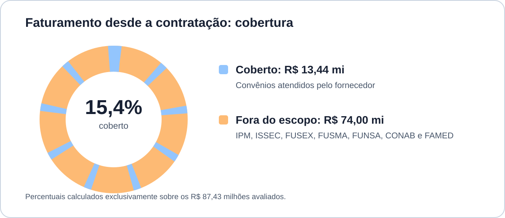
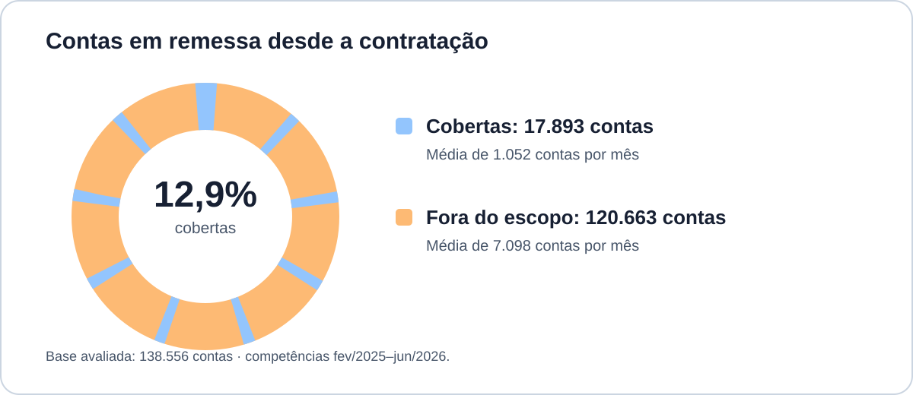
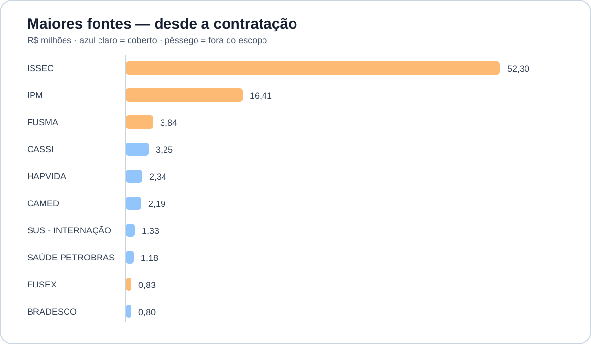
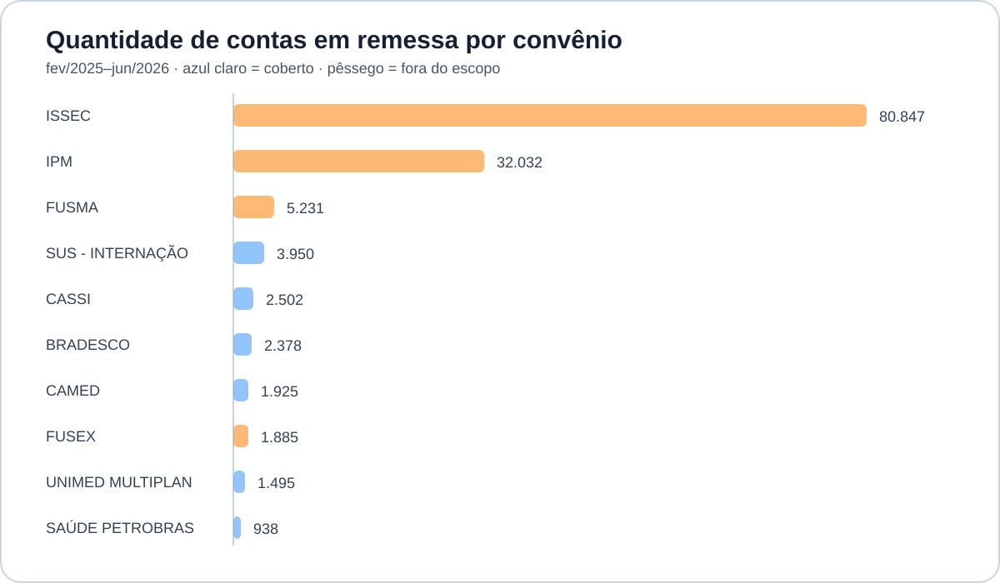

<!-- _class: lead -->

# Faturamento e efetividade da contratação

## Zero Glosa Tecnologia

Avaliação econômico-financeira, cobertura e evidência disponível

**Período de faturamento:** fevereiro de 2025 a junho de 2026
**Histórico de custo:** fevereiro de 2025 a junho de 2026

---

# Conclusão executiva

  

Faturamento coberto - ZeroGlosa

R$ 13,44 mi

15,4% da base avaliada

  

Custo bruto acumulado - ZeroGlosa

R$ 104,4 mil

0,78% da receita coberta

  

Faturamento fora do escopo - ZeroGlosa

R$ 74,00 mi

84,6% da base avaliada

### Parecer

**A contratação tem ponto de equilíbrio baixo**, para comprovar efetividade realizada é necessário calcular a taxa de sucesso [Recursos X Conversões]

---

# Escopo e método

### Receita analisada

- Contas hospitalares e ambulatoriais faturadas por competência.
- Valores consolidados sem repetição de contas.

### Custo contratado

- Valor bruto reconhecido e pagamentos efetivamente realizados.

### Efetividade

- Indicador desejado: valor recuperado de glosas atribuível ao fornecedor.
- Situação encontrada: não há histórico atual de recursos e recuperações integrado aos controles internos.

---

<!-- _class: chart-slide -->

# Análise por valor e quantidade

  

    <h3>Por valor: cobertura de 15,4% da base avaliada</h3>
    
  

  

    <h3>Quantitativa: volume de contas em remessa</h3>
    
  

---

<!-- _class: chart-slide -->

# Análise por convênio

  

    <h3>Por valor: concentração do faturamento</h3>
    
  

  

    <h3>Quantitativa: contas em remessa por convênio</h3>
    
  

---

# Avaliação do volume operacional

| Grupo | Contas | Participação | Faturamento | Ticket médio |
|---|---:|---:|---:|---:|
| Coberto | 17.893 | 12,9% | R$ 13,44 mi | R$ 751 |
| Fora do escopo | 120.663 | 87,1% | R$ 74,00 mi | R$ 613 |
| **Total avaliado** | **138.556** | **100%** | **R$ 87,43 mi** | **R$ 631** |

### Leituras

- O fornecedor atende **1 em cada 8 contas** da base avaliada.
- ISSEC e IPM concentram **81,5% das contas**, elevando fortemente o volume operacional não atendido.
- A cobertura financeira (15,4%) é superior à cobertura por quantidade (12,9%), sinal de maior valor médio nas contas cobertas.

---

# Convênios fora do atendimento do fornecedor

| Convênio | Desde a contratação | Participação no total |
|---|---:|---:|
| ISSEC | R$ 52.301.060,66 | 52,5% |
| IPM | R$ 16.411.928,80 | 16,5% |
| FUSMA | R$ 3.834.942,37 | 3,8% |
| FUSEX | R$ 834.397,50 | 0,8% |
| FUNSA | R$ 448.700,48 | 0,5% |
| FAMED | R$ 144.350,45 | 0,1% |
| CONAB | R$ 20.708,23 | &lt;0,1% |

<strong>Implicação:</strong> ⚠️Bom resultado do fornecedor não reduz o risco de glosa sobre a MAIOR PARTE DA RECEITA; Contrato deve ser avaliado apenas sobre os R$ 13,44 milhões cobertos.

