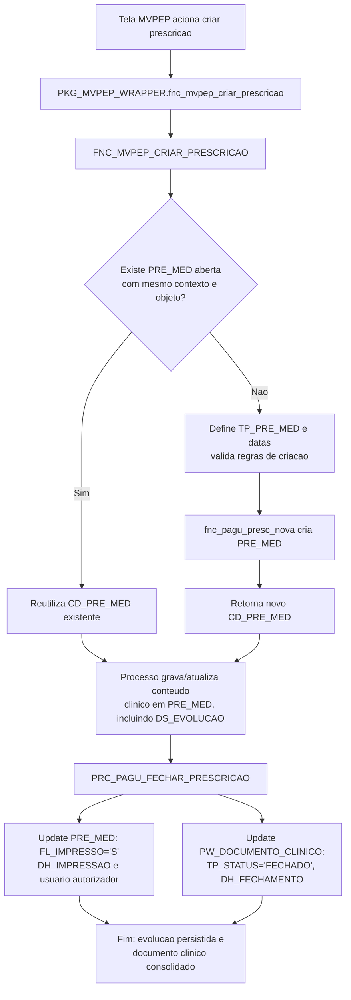
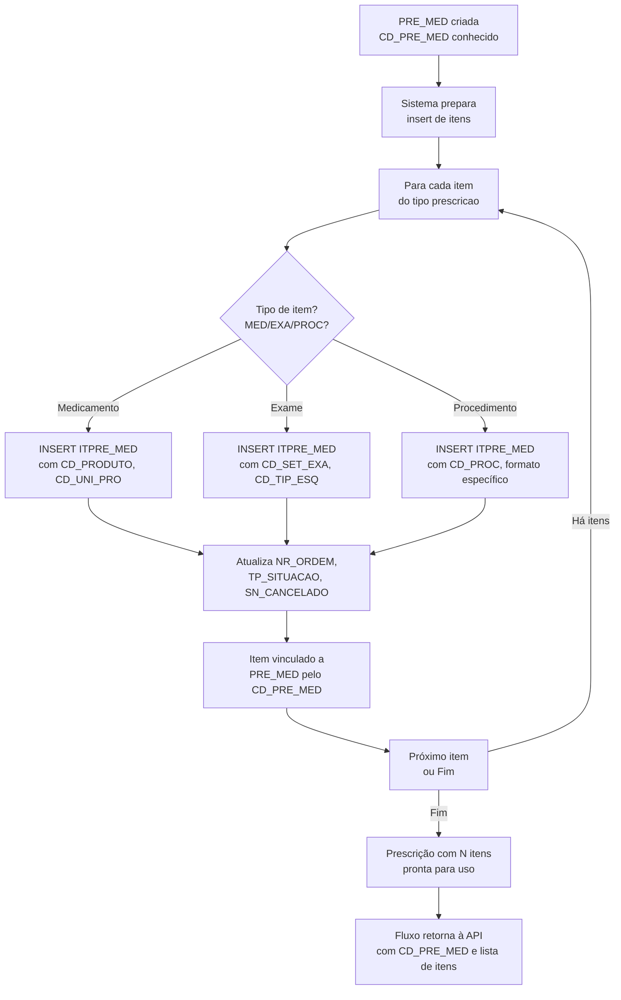

# Linha de Cuidado: Fluxos de Prescrição Clínica

---

# Parte 1: INSERT em PW_DOCUMENTO_CLINICO + PRE_MED

## Fluxograma: Documento Clínico + Cabeçalho da Prescrição



## Explicações: Como funciona o fluxo

### Objetivo
Criar um documento clínico (`PW_DOCUMENTO_CLINICO`) e associá-lo a uma prescrição (`PRE_MED`), gerando um vínculo de evolução clínica que persiste em base de dados com regras de negócio validadas.

### Diferença entre as duas funções principais

### `PKG_MVPEP_WRAPPER.fnc_mvpep_criar_prescricao(...)`
- É uma porta de entrada (wrapper).
- Recebe a chamada da tela/serviço.
- Encaminha para a função de negócio.
- Retorna o `CD_PRE_MED`.

### `dbamv.fnc_pagu_presc_nova(...)`
- É a rotina que efetivamente cria a nova prescrição.
- Ela é chamada de dentro de `FNC_MVPEP_CRIAR_PRESCRICAO` quando precisa criar.
- Não é chamada direto pela tela nesse fluxo.

`PKG_MVPEP_WRAPPER.fnc_mvpep_criar_prescricao` orquestra a chamada; `dbamv.fnc_pagu_presc_nova` faz a criação física da nova `PRE_MED`.

## O que `FNC_PAGU_PRESC_NOVA` faz na prática
- Gera um novo `CD_PRE_MED` pela sequencia (`SEQ_PRE_MED.NEXTVAL`).
- Monta e grava um novo registro em `DBAMV.PRE_MED` (`INSERT INTO PRE_MED`).
- Cria o registro inicial com `DS_EVOLUCAO = NULL` (a evolucao textual e preenchida depois).
- Associa o novo registro ao documento clínico (`CD_DOCUMENTO_CLINICO`) e devolve o `CD_PRE_MED` criado.

## Relacionamento 1:* opcional e query principal

No contexto funcional deste fluxo, a leitura correta é esta:

- todo documento clínico criado por esse fluxo termina com registro em `PRE_MED`;
- a relação continua sendo `1:* opcional` no lado da `PRE_MED`, porque a tabela de prescrição também recebe registros vindos de outros documentos;
- por isso, nem toda `PRE_MED` nasce com `PW_DOCUMENTO_CLINICO` no mesmo caminho;
- a chave de associação usada no fluxo é `CD_DOCUMENTO_CLINICO`.

Query base com campos principais da junção:

```sql
SELECT
	pdc.cd_documento_clinico,
	pdc.cd_atendimento,
	pdc.cd_prestador,
	pdc.tp_status,
	pdc.dh_referencia,
	pdc.dh_criacao,
	pdc.dh_fechamento,
	pm.cd_pre_med,
	pm.tp_pre_med,
	pm.fl_impresso,
	pm.dt_referencia,
	pm.dt_pre_med,
	pm.hr_pre_med,
	pm.dt_validade,
	pm.nm_usuario,
	pm.ds_evolucao
FROM dbamv.pw_documento_clinico pdc
INNER JOIN dbamv.pre_med pm
	ON pm.cd_documento_clinico = pdc.cd_documento_clinico
WHERE pdc.cd_atendimento = :cd_atendimento
ORDER BY pdc.cd_documento_clinico DESC;
```

Use `INNER JOIN` neste exemplo porque ele representa o fluxo principal documentado aqui: `PW_DOCUMENTO_CLINICO` criado pela API com `PRE_MED` correspondente.

## Fluxo prático
1. Tela chama `PKG_MVPEP_WRAPPER.fnc_mvpep_criar_prescricao(...)`.
2. O wrapper chama `DBAMV.FNC_MVPEP_CRIAR_PRESCRICAO(...)`.
3. A função procura uma `PRE_MED` aberta para o mesmo contexto.
4. Se existir, reutiliza o `CD_PRE_MED`; se não existir, chama `dbamv.fnc_pagu_presc_nova(...)` para criar.
5. O sistema grava/atualiza o conteúdo clínico (incluindo `DS_EVOLUCAO`).

## Referências de arquivos que implementam este fluxo
- `PKG_MVPEP_WRAPPER.sql`: mostra o wrapper delegando.
- `FNC_MVPEP_CRIAR_PRESCRICAO.sql`: mostra a regra de reutilizar ou criar.
- `FNC_PAGU_PRESC_NOVA.sql`: mostra a criação física da nova linha em `PRE_MED`.
- `DDL_PRE_MED.sql`: mostra estrutura da tabela e trigger de sincronização documental.
- `PRC_PAGU_FECHAR_PRESCRICAO.sql`: mostra a consolidação final no fechamento.

## Endpoints sugeridos para este fluxo

### Endpoint 1a: Criar documento clínico + prescrição (evolução/consulta)

**Objetivo**: receber contexto clínico da API, criar `PW_DOCUMENTO_CLINICO` e gerar/reutilizar `PRE_MED`.

**Regra obrigatória**: criar primeiro `PW_DOCUMENTO_CLINICO`, depois gerar `PRE_MED`.

**Método e rota**: `POST /api/v1/prescricoes/criar-evolucao`

**Contrato**:
```json
{
  "cd_atendimento": 302831,
  "cd_paciente": 12345,
  "cd_prestador": 781,
  "cd_objeto": 511,
  "tp_acao_tela": "EVO",
  "tp_objeto": "MEDICA",
  "cd_setor": 10,
  "cd_setor_maquina": 10,
  "cd_unid_int": 7,
  "dt_prescricao": "2026-05-19T12:02:26",
  "dt_validade": "2026-05-20T14:00:00",
  "nm_usuario": "DBAMV"
}
```

**Exemplo simplificado de implementação**:

```python
from datetime import datetime
from fastapi import FastAPI, HTTPException
from pydantic import BaseModel
import oracledb

app = FastAPI()


class EvolucaoRequest(BaseModel):
	cd_atendimento: int
	cd_paciente: int
	cd_prestador: int
	cd_objeto: int
	tp_acao_tela: str = "EVO"
	cd_setor: int | None = None
	cd_setor_maquina: int | None = None
	cd_unid_int: int | None = None
	dt_prescricao: datetime | None = None
	dt_validade: datetime | None = None
	nm_usuario: str


def get_conn():
	return oracledb.connect(user="app", password="***", dsn="host/service")


@app.post("/api/v1/prescricoes/criar-evolucao")
def criar_evolucao(req: EvolucaoRequest):
	conn = get_conn()
	try:
		with conn.cursor() as cur:
			# 1) Regra obrigatoria: cria primeiro o documento clinico
			cur.execute("select dbamv.seq_pw_documento_clinico.nextval from dual")
			cd_documento_clinico = cur.fetchone()[0]

			cur.execute(
				"""
				insert into dbamv.pw_documento_clinico (
					cd_documento_clinico,
					cd_tipo_documento,
					cd_paciente,
					cd_atendimento,
					cd_usuario,
					cd_prestador,
					tp_status,
					dh_referencia,
					dh_criacao,
					dh_documento,
					cd_objeto
				) values (
					:cd_documento_clinico,
					dbamv.fnc_pep_busca_codigo_tip_docum('EVOMED'),
					:cd_paciente,
					:cd_atendimento,
					:nm_usuario,
					:cd_prestador,
					'ABERTO',
					:dh_referencia,
					sysdate,
					:dh_documento,
					:cd_objeto
				)
				""",
				{
					"cd_documento_clinico": cd_documento_clinico,
					"cd_paciente": req.cd_paciente,
					"cd_atendimento": req.cd_atendimento,
					"nm_usuario": req.nm_usuario,
					"cd_prestador": req.cd_prestador,
					"dh_referencia": req.dt_prescricao,
					"dh_documento": req.dt_prescricao,
					"cd_objeto": req.cd_objeto,
				},
			)

			# 2) Depois gera/reutiliza PRE_MED com o contexto clinico
			cur.execute(
				"""
				select dbamv.fnc_mvpep_criar_prescricao(
					:cd_atendimento,
					:tp_acao_tela,
					:cd_setor,
					:tp_objeto,
					:cd_setor_maquina,
					:cd_objeto,
					:cd_unid_int,
					:dh_pre_med,
					:dt_validade
				)
				from dual
				""",
				{
					"cd_atendimento": req.cd_atendimento,
					"tp_acao_tela": req.tp_acao_tela,
					"dt_prescricao": req.dt_prescricao,
					"cd_setor": req.cd_setor,
					"tp_objeto": req.tp_objeto,
					"cd_setor_maquina": req.cd_setor_maquina,
					"cd_objeto": req.cd_objeto,
					"cd_unid_int": req.cd_unid_int,
					"dh_pre_med": req.dt_prescricao,
					"dt_validade": req.dt_validade,
				},
			)

		conn.commit()
		return {
			"cd_documento_clinico": cd_documento_clinico,
			"cd_pre_med": cd_pre_med,
			"status": "ok",
		}
	except Exception as exc:
		conn.rollback()
		raise HTTPException(status_code=400, detail=str(exc))
	finally:
		conn.close()
```

**Resposta esperada**:
```json
{
  "cd_documento_clinico": 2746304,
  "cd_pre_med": 791775,
  "status": "ok"
}
```

### Endpoint 1b: Fechar prescrição e documento

**Objetivo**: consolidar a prescrição, atualizar status em `PRE_MED` e `PW_DOCUMENTO_CLINICO`, marcando como impressa/fechada.

**Método e rota**: `POST /api/v1/prescricoes/{cd_pre_med}/fechar`

**Contrato**:
```json
{
  "nm_usuario_autorizador": "DR_SILVA"
}
```

**Resposta esperada**:
```json
{
  "cd_pre_med": 791775,
  "fl_impresso": "S",
  "dh_impressao": "2026-05-19T16:45:30",
  "status": "fechado"
}
```

## Conclusão desta parte

A persistência de evolução em `PRE_MED` não é um `INSERT` direto; segue um fluxo governado por regras PL/SQL que:
1. **Cria primeiro** o documento clínico (`PW_DOCUMENTO_CLINICO`).
2. **Reutiliza ou cria** a prescrição (`PRE_MED`) conforme contexto.
3. **Grava/atualiza** o conteúdo clínico (evolução textual) durante o uso.
4. **Consolida** o documento clínico no fechamento da prescrição.

O ponto crítico é que `PW_DOCUMENTO_CLINICO` e `PRE_MED` mantêm **sincronismo via trigger e rotina de fechamento**, garantindo integridade referencial e auditoria do fluxo.

---

# Parte 2: INSERT em PRE_MED + ITPRE_MED

## Fluxograma: Cabeçalho + Itens da Prescrição



## Explicações: Como funciona a prescrição em dois níveis

### Visão simples da relação PRE_MED + ITPRE_MED
- `PRE_MED` é o **cabeçalho** da prescrição (atendimento, data de referência, tipo, status e vínculo clínico).
- `ITPRE_MED` são os **itens** (medicamentos, exames, procedimentos, etc.).
- A relação prática é: `PRE_MED.CD_PRE_MED` → `ITPRE_MED.CD_PRE_MED` (1:N obrigatória).

### Como ocorre o INSERT no fluxo

1. **PRE_MED já existe** (foi criado na Parte 1 ou reutilizado).
2. **No código**, isso ocorre em `FNC_PAGU_PRESC_NOVA.sql` com `INSERT INTO DBAMV.PRE_MED`.
3. **Depois são inseridos os itens** em `ITPRE_MED`, sempre apontando para o `CD_PRE_MED` criado/reutilizado.
4. **No trace** (`query_detect.sql`), aparecem **múltiplos `INSERT INTO DBAMV.ITPRE_MED`** com variações de colunas.
5. **Essas variações representam tipos diferentes** de item.

#### Exemplos práticos de variações:
- **Inserts com `CD_PRODUTO` e `CD_UNI_PRO`**: cenário típico de medicação/produto.
- **Inserts com `CD_FOR_APL`**: cenário com forma de aplicação.
- **Inserts sem alguns campos opcionais**: exames/procedimentos ou itens com estrutura diferente.

### Evidências diretas encontradas

- **Criação do cabeçalho**: `FNC_PAGU_PRESC_NOVA.sql` contém `Insert Into Dbamv.Pre_Med (...)`.
- **Estrutura dos itens**: `ITPRE_MED.sql` mostra FK `ITPRE_MED_PRE_MED_FK` (`CD_PRE_MED`) e FK para `TIP_PRESC` (`CD_TIP_PRESC`), que define o tipo do item prescrito.
- **Trace de execução**: `query_detect.sql` contém inserts como `insert into dbamv.ITPRE_MED (... CD_PRE_MED, CD_TIP_PRESC, CD_ITPRE_MED ...) values (...)`.
- **Suporte auxiliar**: chamadas de apoio como `PRC_PAGU_COPIA_ITPRESC_PADRAO` e consultas de listagem por `CD_PRE_MED` (`FNC_MVPEP_LISTAITEMPRESCRICAO`).

### Query base para análise: prescrição com todos os itens

```sql
SELECT
    pm.cd_pre_med,
    pm.cd_atendimento,
    pm.tp_pre_med,
    pm.dt_referencia,
    pm.fl_impresso,
    ipm.cd_itpre_med,
    ipm.cd_tip_presc,
    ipm.cd_tip_esq,
    ipm.cd_produto,
    ipm.ds_itpre_med,
    ipm.tp_situacao,
    ipm.sn_cancelado,
    ipm.nr_ordem
FROM dbamv.pre_med pm
INNER JOIN dbamv.itpre_med ipm
        ON ipm.cd_pre_med = pm.cd_pre_med
WHERE pm.cd_pre_med = :cd_pre_med
ORDER BY ipm.nr_ordem, ipm.cd_itpre_med;
```

## Endpoints sugeridos para este fluxo

### Endpoint 2a: Listar itens da prescrição

**Objetivo**: retornar todos os itens (`ITPRE_MED`) de uma prescrição (`PRE_MED`).

**Método e rota**: `GET /api/v1/prescricoes/{cd_pre_med}/itens`

**Resposta esperada**:
```json
[
  {
    "cd_itpre_med": 1001,
    "cd_pre_med": 791775,
    "cd_tip_presc": 5,
    "cd_tipo_esq": "MED",
    "cd_produto": 4521,
    "ds_itpre_med": "Dipirona 500mg",
    "qt_itpre_med": 2,
    "tp_situacao": "N",
    "nr_ordem": 1
  },
  {
    "cd_itpre_med": 1002,
    "cd_pre_med": 791775,
    "cd_tip_presc": 12,
    "cd_tipo_esq": "EXA",
    "cd_set_exa": 89,
    "ds_itpre_med": "Hemograma",
    "tp_situacao": "N",
    "nr_ordem": 2
  }
]
```

### Endpoint 2b: Adicionar item à prescrição

**Objetivo**: inserir um novo item (`ITPRE_MED`) em uma prescrição aberta.

**Método e rota**: `POST /api/v1/prescricoes/{cd_pre_med}/itens`

**Contrato**:
```json
{
  "cd_tip_presc": 5,
  "cd_tipo_esq": "MED",
  "cd_produto": 4521,
  "cd_uni_pro": 1,
  "qt_itpre_med": 2,
  "ds_itpre_med": "Dipirona 500mg, 2 comprimidos a cada 6 horas",
  "nr_ordem": 1
}
```

**Resposta esperada**:
```json
{
  "cd_itpre_med": 1001,
  "cd_pre_med": 791775,
  "status": "criado"
}
```

**Variação para exame**:
```json
{
  "cd_tip_presc": 12,
  "cd_tipo_esq": "EXA",
  "cd_set_exa": 89,
  "ds_itpre_med": "Hemograma",
  "nr_ordem": 2
}
```

## Conclusão desta parte

A prescrição é estruturada em **dois níveis hierárquicos**:

1. **Cabeçalho (PRE_MED)**: criado uma única vez por contexto clínico; reutilizado se compatível.
2. **Itens (ITPRE_MED)**: inseridos com **flexibilidade de campos** conforme tipo de prescrição:
   - Medicamentos: com `CD_PRODUTO`, `CD_UNI_PRO`, `QT_ITPRE_MED`
   - Exames: com `CD_SET_EXA`, `CD_TIP_ESQ`
   - Procedimentos: com `CD_PROC` ou equivalente

- O INSERT em `PRE_MED` ocorre **uma única vez** por prescrição.
- Os INSERTs em `ITPRE_MED` são **múltiplos** (1 por item), cada um atualizado conforme o tipo.
- A relação é **1:N obrigatória**, permitindo uma prescrição com múltiplos itens.
- O tipo de item é um atributo de negócio determinado por `CD_TIP_PRESC` e configurações da rotina de inserção.

---

## Referências de arquivos que implementam este fluxo
- `ITPRE_MED.sql`: DDL com estrutura, FKs e triggers.
- `query_detect.sql`: Exemplos de múltiplos INSERT patterns.
- `FNC_MVPEP_LISTAITEMPRESCRICAO`: Função auxiliar de listagem de itens.
- `PRC_PAGU_COPIA_ITPRESC_PADRAO`: Procedure de cópia de itens padrão.

---

## Conclusão geral

O sistema de prescrição é composto por **duas partes bem definidas**:

### Parte 1: Documento Clínico + Prescrição
- Cria ou reutiliza a prescrição clínica
- Vincula documento a prescrição
- Persiste evolução textual
- Consolida ao final

### Parte 2: Prescrição + Itens
- Popula prescrição com medicamentos, exames, procedimentos
- Suporta múltiplos tipos com estruturas flexíveis
- Mantém ordem e status dos itens
- Permite operações de CRUD independentes

**Garantias do fluxo**:
- Não há `INSERT` direto da tela; tudo passa por regras PL/SQL validadas
- Sincronismo automático via triggers entre documento e prescrição
- Auditoria completa de criação, modificação e fechamento
- Reutilização inteligente de prescrições compatíveis
