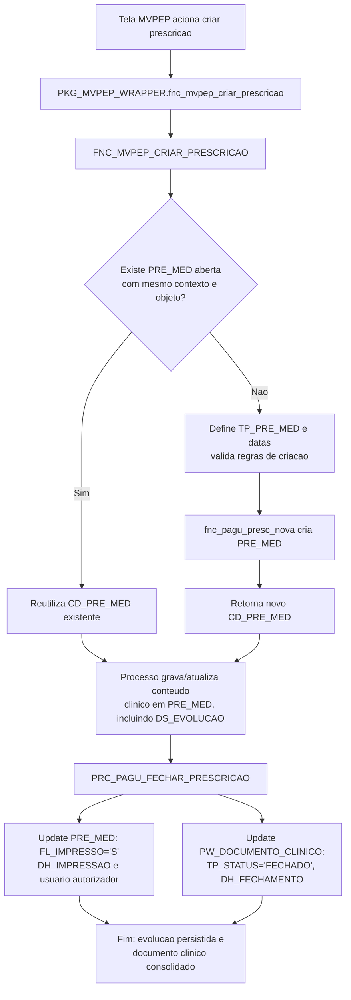

# Persistencia de evolucao em PRE_MED

## Fluxograma da insercao em PRE_MED



## Objetivo
Explicar, de forma simples, como a evolucao vira registro em `PRE_MED`.

## Diferenca entre as duas funcoes

### `PKG_MVPEP_WRAPPER.fnc_mvpep_criar_prescricao(...)`
- E uma porta de entrada (wrapper).
- Recebe a chamada da tela/servico.
- Encaminha para a funcao de negocio.
- Retorna o `CD_PRE_MED`.

### `dbamv.fnc_pagu_presc_nova(...)`
- E a rotina que efetivamente cria a nova prescricao.
- Ela e chamada de dentro de `FNC_MVPEP_CRIAR_PRESCRICAO` quando precisa criar.
- Nao e chamada direto pela tela nesse fluxo.

`PKG_MVPEP_WRAPPER.fnc_mvpep_criar_prescricao` orquestra a chamada; `dbamv.fnc_pagu_presc_nova` faz a criacao fisica da nova `PRE_MED`.

## O que `FNC_PAGU_PRESC_NOVA` faz na pratica
- Gera um novo `CD_PRE_MED` pela sequencia (`SEQ_PRE_MED.NEXTVAL`).
- Monta e grava um novo registro em `DBAMV.PRE_MED` (`INSERT INTO PRE_MED`).
- Cria o registro inicial com `DS_EVOLUCAO = NULL` (a evolucao textual e preenchida depois).
- Associa o novo registro ao documento clinico (`CD_DOCUMENTO_CLINICO`) e devolve o `CD_PRE_MED` criado.

## Relacionamento 1:* opcional e query principal

No contexto funcional deste fluxo, considere o relacionamento entre `PW_DOCUMENTO_CLINICO` e `PRE_MED` como `1:* opcional`.

- Opcional: pode existir documento clinico sem linha correspondente em `PRE_MED`.
- Vinculo: a chave de associacao usada no fluxo e `CD_DOCUMENTO_CLINICO`.

Query base com campos principais da juncao:

```sql
SELECT
	pdc.cd_documento_clinico,
	pdc.cd_atendimento,
	pdc.cd_paciente,
	pdc.cd_prestador,
	pdc.tp_status,
	pdc.dh_referencia,
	pdc.dh_criacao,
	pdc.dh_fechamento,
	pm.cd_pre_med,
	pm.tp_pre_med,
	pm.fl_impresso,
	pm.dt_referencia,
	pm.dt_pre_med,
	pm.hr_pre_med,
	pm.dt_validade,
	pm.nm_usuario,
	pm.ds_evolucao
FROM dbamv.pw_documento_clinico pdc
LEFT JOIN dbamv.pre_med pm
	   ON pm.cd_documento_clinico = pdc.cd_documento_clinico
WHERE pdc.cd_atendimento = :cd_atendimento
ORDER BY pdc.cd_documento_clinico DESC;
```

## Fluxo simples
1. Tela chama `PKG_MVPEP_WRAPPER.fnc_mvpep_criar_prescricao(...)`.
2. O wrapper chama `DBAMV.FNC_MVPEP_CRIAR_PRESCRICAO(...)`.
3. A funcao procura uma `PRE_MED` aberta para o mesmo contexto.
4. Se existir, reutiliza o `CD_PRE_MED`; se nao existir, chama `dbamv.fnc_pagu_presc_nova(...)` para criar.
5. O sistema grava/atualiza o conteudo clinico (incluindo `DS_EVOLUCAO`).
6. No fechamento, `PRC_PAGU_FECHAR_PRESCRICAO` marca `PRE_MED` como impressa/fechada e fecha `PW_DOCUMENTO_CLINICO`.

## Onde cada arquivo ajuda
- `PKG_MVPEP_WRAPPER.sql`: mostra o wrapper delegando.
- `FNC_MVPEP_CRIAR_PRESCRICAO.sql`: mostra a regra de reutilizar ou criar.
- `FNC_PAGU_PRESC_NOVA.sql`: mostra a criacao fisica da nova linha em `PRE_MED`.
- `DDL_PRE_MED.sql`: mostra estrutura da tabela e trigger de sincronizacao documental.
- `PRC_PAGU_FECHAR_PRESCRICAO.sql`: mostra a consolidacao final no fechamento.

## Exemplo de endpoint FastAPI (documento clinico + criacao de PRE_MED)

Objetivo do endpoint:
- receber contexto clinico da API,
- criar `PW_DOCUMENTO_CLINICO`,
- chamar a funcao de negocio para criar/reutilizar `PRE_MED`.

Regra desta API (obrigatoria):
- sempre criar primeiro `PW_DOCUMENTO_CLINICO`,
- depois gerar `PRE_MED`.

Ordem de execucao na API:
1. `INSERT` em `PW_DOCUMENTO_CLINICO`.
2. chamada da regra de negocio para gerar/reutilizar `PRE_MED`.
3. retorno de `cd_documento_clinico` e `cd_pre_med` na resposta.

### Contrato sugerido

`POST /api/v1/prescricoes/evolucao`

```json
{
  "cd_atendimento": 302831,
  "cd_paciente": 12345,
  "cd_prestador": 781,
  "cd_objeto": 511,
  "tp_acao_tela": "EVO",
  "tp_objeto": "MEDICA",
  "cd_setor": 10,
  "cd_setor_maquina": 10,
  "cd_unid_int": 7,
  "dt_prescricao": "2026-05-19T12:02:26",
  "dt_validade": "2026-05-20T14:00:00",
  "nm_usuario": "DBAMV"
}
```

### Exemplo simplificado de implementacao

```python
from datetime import datetime
from fastapi import FastAPI, HTTPException
from pydantic import BaseModel
import oracledb

app = FastAPI()


class EvolucaoRequest(BaseModel):
	cd_atendimento: int
	cd_paciente: int
	cd_prestador: int
	cd_objeto: int
	tp_acao_tela: str = "EVO"
	tp_objeto: str = "MEDICA"
	cd_setor: int | None = None
	cd_setor_maquina: int | None = None
	cd_unid_int: int | None = None
	dt_prescricao: datetime | None = None
	dt_validade: datetime | None = None
	nm_usuario: str


def get_conn():
	return oracledb.connect(user="app", password="***", dsn="host/service")


@app.post("/api/v1/prescricoes/evolucao")
def criar_evolucao(req: EvolucaoRequest):
	conn = get_conn()
	try:
		with conn.cursor() as cur:
			# 1) Regra obrigatoria: cria primeiro o documento clinico
			cur.execute("select dbamv.seq_pw_documento_clinico.nextval from dual")
			cd_documento_clinico = cur.fetchone()[0]

			cur.execute(
				"""
				insert into dbamv.pw_documento_clinico (
					cd_documento_clinico,
					cd_tipo_documento,
					cd_paciente,
					cd_atendimento,
					cd_usuario,
					cd_prestador,
					tp_status,
					dh_referencia,
					dh_criacao,
					dh_documento,
					cd_objeto
				) values (
					:cd_documento_clinico,
					dbamv.fnc_pep_busca_codigo_tip_docum('EVOMED'),
					:cd_paciente,
					:cd_atendimento,
					:nm_usuario,
					:cd_prestador,
					'ABERTO',
					:dh_referencia,
					sysdate,
					:dh_documento,
					:cd_objeto
				)
				""",
				{
					"cd_documento_clinico": cd_documento_clinico,
					"cd_paciente": req.cd_paciente,
					"cd_atendimento": req.cd_atendimento,
					"nm_usuario": req.nm_usuario,
					"cd_prestador": req.cd_prestador,
					"dh_referencia": req.dt_prescricao,
					"dh_documento": req.dt_prescricao,
					"cd_objeto": req.cd_objeto,
				},
			)

			# 2) Depois gera/reutiliza PRE_MED com o contexto clinico
			cur.execute(
				"""
				select dbamv.fnc_mvpep_criar_prescricao(
					:cd_atendimento,
					:tp_acao_tela,
					:dt_prescricao,
					:cd_setor,
					:tp_objeto,
					:cd_setor_maquina,
					:cd_objeto,
					:cd_unid_int,
					:dh_pre_med,
					:dt_validade
				)
				from dual
				""",
				{
					"cd_atendimento": req.cd_atendimento,
					"tp_acao_tela": req.tp_acao_tela,
					"dt_prescricao": req.dt_prescricao,
					"cd_setor": req.cd_setor,
					"tp_objeto": req.tp_objeto,
					"cd_setor_maquina": req.cd_setor_maquina,
					"cd_objeto": req.cd_objeto,
					"cd_unid_int": req.cd_unid_int,
					"dh_pre_med": req.dt_prescricao,
					"dt_validade": req.dt_validade,
				},
			)
			cd_pre_med = cur.fetchone()[0]

		conn.commit()
		return {
			"cd_documento_clinico": cd_documento_clinico,
			"cd_pre_med": cd_pre_med,
			"status": "ok",
		}
	except Exception as exc:
		conn.rollback()
		raise HTTPException(status_code=400, detail=str(exc))
	finally:
		conn.close()
```

### Resposta esperada

```json
{
  "cd_documento_clinico": 2746304,
  "cd_pre_med": 791775,
  "status": "ok"
}
```

## Conclusao
Nao ha um `INSERT` direto da tela em `PRE_MED` nesse desenho. O processo passa por regras PL/SQL: decide reutilizar/criar, grava evolucao e depois consolida no fechamento.
