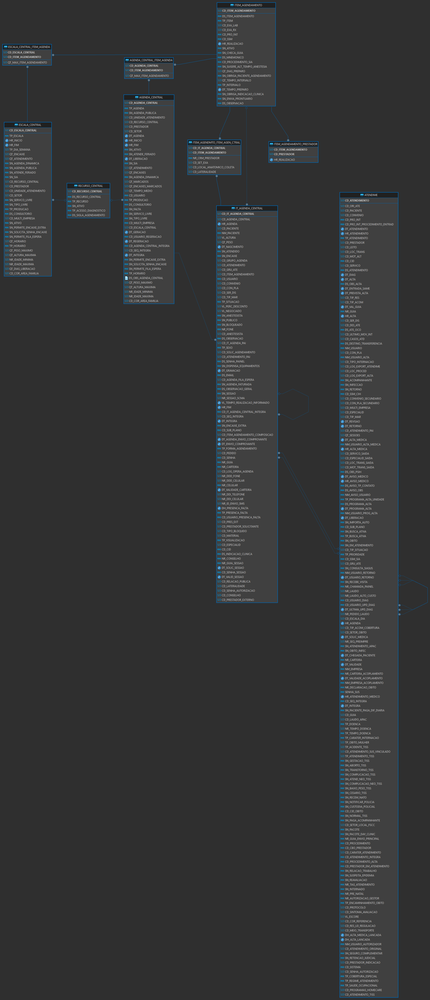

CODE REVIEW TABIA
===

<br>
<br>

### VALIDAÇÃO DAS QUERIES:
- APPOINTMENTS POR PERIODO (AGENDAMENTOS)
- SERVICE REQUEST POR PERIODO (PEDIDOS - EXAMES/CIRURGIAS)
- ENCOUNTERS POR PERIODO (ATENDIMENTOS)

<br>

### TELAS DO ERP UTILIZADAS NA VALIDAÇÃO:
- **M_CENTRAL_MARCACOES**
    - Visualizar os horários disponíveis para os itens da agendar (consultas, procedimentos e exames), assim como informações de convênio, paciente e realização dos procedimentos;
    - Essa tela, o profissional do call-center ou da recepção do consultório poderá visualizar os horários para agendamentos de múltiplos itens (exames e consultas) de forma unificada;
    - *Obs.: Para ter acesso a agendamentos realizados pelos sistemas Ambulatório, Diagnóstico de Imagem e Laboratório de Análise Clínicas, é necessário que a configuração "Utiliza o SCMA para Agendamentos Ambulatoriais, Laboratoriais e Diag. Imagem no Sistema", esteja como "Sim".

- **C_AGENDAMENTOS:**
    - Consultar os agendamentos realizados, segundo alguns critérios concernentes a eles, por meio da informação de parâmetros de pesquisa.

- **M_ALTERA_ESCALA:**

- **M_RECEPCAO_MANUT_AGENDA:**

<br>
<br>


# OCORRENCIAS:

<details>
    <summary><strong>⛧ APPOINTMENTS POR PERIODO:</strong></summary>

* OBJETIVO: Listar bukets de agenda de cada lote de agenda das escalas por período
  ---

<br>

* **CÓDIGO DE BUCKETS DA AGENDA REPETIDOS:**

    - **Existe "CD_IT_AGENDA_CENTRAL" se repetindo para atendimentos distintos do mesmo paciente que NÃO POSSUI AGENDAMENTO e para AGENDAMENTOS COM OUTRO "CD_IT_AGENDA_CENTRAL"**
        - Exemplo:
            - CD_IT_AGENDA_CENTRAL = 775793 retorna os CD_ATENDIMENTO:
                - 242685 -> CD_IT_AGENDA_CENTRAL = 775793 ✅
                - 242621 -> CD_IT_AGENDA_CENTRAL = 786669 ❌
                - 242654 -> SEM AGENDAMENTO
                > [!NOTE] O relacionamento entre as tabelas `DBAMV.AGENDA_CENTRAL` e `DBAMV.IT_AGENDA_CENTRAL` é `1:* Obirgatório`

            - **Sugestão de Solução:** Organização do contexto semântico das tabelas envolvidas no tema *'agendamento'* e do problema que queremos resolver.
    ---

<br>
<br>


- **RELACIONAMENTO ENTRE "IT_AGENDA_CENTRAL" e "ATENDIME":**
    - O join entre as tabelas ``IT_AGENDA_CENTRAL`` e ``ATENDIME`` foi estabelecido  por ``CD_PACIENTE`` e ``DT_ATENDIMENTO`` = ``HR_AGENDA``, porém existe relacionamento direto do tipo *`1:* opcional`*, opcional, pois no momento do agendamento ainda não existe o CD_ATENDIMENTO; caso tenha optado por essa relação para garantir consistência entre as tabelas, a trigger `TRG_IT_AGENDA_CENTRAL_ATENDIME` já faz esse trabalho garantindo que essas tabelas tenham o mesmo ``CD_PACIENTE`` e ``CD_CARTEIRA``.

        - **Sugestão de Solução:** Organização do contexto semântico das tabelas envolvidas no tema *'agendamento'* e do problema que queremos resolver.
    ---

<br>
<br>

- **FILTRO NO JOIN DA TABELA ``AGENDA_CENTRAL_ITEM_AGENDA``:**
    - A tabela ``AGENDA_CENTRAL_ITEM_AGENDA`` é middleman do relacionamento ``*:*`` entre as tabelas ``AGENDA_CENTRAL`` e ``ITEM_AGENDAMENTO``, o filtro em `rn=1`, aparentemente, afeta apenas as linhas cujos agendamentos não foram atendidos; sem esse filtro uma agenda seria replicada para todos os possíveis itens de agendamento. Esse é o outro fator que também gera duplicatas de ``CD_IT_AGENDA_CENTRAL``.


        ```sql
            FROM dbamv.it_agenda_central it
            LEFT JOIN AGENDA_CENTRAL agc ON agc.cd_agenda_central = it.cd_agenda_central
            LEFT JOIN (
            SELECT
                aci.*,
                ROW_NUMBER() OVER (
                    PARTITION BY aci.cd_agenda_central
                    ORDER BY aci.cd_item_agendamento ASC
                ) AS rn
            FROM agenda_central_item_agenda aci
            ) aci ON aci.cd_agenda_central = it.cd_agenda_central
            AND aci.rn = 1
        ```
        - **Sugestão de Solução:** Organização do contexto semântico das tabelas envolvidas no tema *'agendamento'* e do problema que queremos resolver.
    ---

<br>
<br>

- **CÓDIGO DO PROCEDIMENTO:**

    - Faz sentido retornar ``a.CD_PRO_FAT`` quando o agendamento é atendido ou quando a agenda é reservada por um paciênte, quando não, deve-se deixar o campo NULL, pois uma agenda só pode ter um item de agendamento, pois cada horário da agenda só referência um procedimento, isto é, só consigo determinar item quando a agenda é reservada ou quando o atendimento for efetivado.


        ```sql
            NVL(a.cd_pro_int, ia.cd_pro_fat) as "sr_type_code",
        ```
        - **Sugestão de Solução:**
            ```sql
                CASE
                    WHEN a.CD_ATENDIMENTO IS NOT NULL THEN a.CD_PRO_INT
                    WHEN a.CD_ATENDIMENTO IS NULL AND p.CD_PACIENTE IS NOT NULL THEN ia.CD_PRO_FAT
                    ELSE NULL
                END AS "sr_type_code",
            ```
    ---

<br>
<br>


- **TRADUÇÃO DO CAMPO CD_MULTI_EMPRESA:**
    - Internamente não existe esses estabelecimentos:
        ```sql
                CASE WHEN m.CD_MULTI_EMPRESA IS NULL THEN ''
                    ELSE ',{"type":"LOCATION","actor":{"reference":"' || m.CD_MULTI_EMPRESA || '","display":"' ||
                        CASE
                        WHEN m.CD_MULTI_EMPRESA = 1 THEN 'SANTA CATARINA'
                        WHEN m.CD_MULTI_EMPRESA = 2 THEN 'GONCALVES DIAS'
                        WHEN m.CD_MULTI_EMPRESA = 3 THEN 'GOITACAZES'
                        WHEN m.CD_MULTI_EMPRESA = 4 THEN 'CARANGOLA'
                        WHEN m.CD_MULTI_EMPRESA = 5 THEN 'ROFT'
                        WHEN m.CD_MULTI_EMPRESA = 6 THEN 'REDE OFTALMO'
                        WHEN m.CD_MULTI_EMPRESA = 7 THEN 'PASSOS'
                        WHEN m.CD_MULTI_EMPRESA = 8 THEN 'AEP'
                        ELSE 'Nao Cadastrado'
                        END || '"}}'
                END ||
            ']' AS "participantList",
        ```
        - **Sugestão de Solução:** Substituir o CASE WHEN pelo campo ``m.DS_MULTI_EMPRESA``

            ```sql
                '[' ||
                    '{"type":"PATIENT","actor":{"display":"' || REPLACE(p.NM_PACIENTE, '"','\"') || '","reference":"' || a.CD_PACIENTE || '"}}' ||
                    CASE WHEN pr.CD_PRESTADOR IS NULL THEN ''
                        ELSE ',{"type":"PROFESSIONAL","actor":{"reference":"' || pr.CD_PRESTADOR || '","display":"' || REPLACE(pr.NM_PRESTADOR, '"','\"') || '"}}'
                    END ||
                    CASE WHEN m.CD_MULTI_EMPRESA IS NULL THEN ''
                        ELSE ',{"type":"LOCATION","actor":{"reference":"' || m.CD_MULTI_EMPRESA || '","display":"' || m.DS_MULTI_EMPRESA
                    END ||
                ']' AS "participantList"
            ```
    ---

<br>
<br>

<details>

<summary><strong>CÓDIGO REFATORADO:</strong></summary>

-
    ```sql
        WITH fhir_appointments
            AS (
                SELECT DISTINCT
                    p.CD_PACIENTE AS "filter_medical_record_id",
                    LOWER(p.NM_PACIENTE) AS "filter_patient_name",
                    TO_DATE(TO_CHAR(it.hr_agenda, 'yyyy-mm-dd'),'YYYY-MM-DD') AS "filter_schedule_date",
                    TO_DATE(TO_CHAR(NVL(a.DT_ALTA, a.DT_ATENDIMENTO), 'yyyy-mm-dd'),'YYYY-MM-DD') AS "filter_updated_date",

                    it.cd_it_agenda_central AS "id",
                    it.cd_agenda_central AS "id_agc_central",
                    CASE
                        WHEN agc.tp_agenda = 'L' THEN 'Laboratorio'
                        WHEN agc.tp_agenda = 'A' THEN 'Ambulatorio'
                        WHEN agc.tp_agenda = 'I' THEN 'Diagnostico Por Imagem'
                        ELSE NULL
                    END as "type",
                    CASE
                        WHEN a.cd_atendimento IS NOT NULL THEN 'fulfilled'
                        WHEN a.cd_atendimento IS NULL THEN
                        CASE
                            WHEN it.hr_agenda > CURRENT_TIMESTAMP THEN 'booked'
                            WHEN it.hr_agenda >= CURRENT_TIMESTAMP + INTERVAL '1' DAY THEN 'pending'
                            ELSE 'noshow'
                        END
                        ELSE 'proposed'
                    END AS "status",
                    CASE
                        WHEN a.CD_ATENDIMENTO IS NOT NULL THEN a.CD_PRO_INT
                        WHEN a.CD_ATENDIMENTO IS NULL AND p.CD_PACIENTE IS NOT NULL THEN ia.CD_PRO_FAT
                        ELSE NULL
                    END AS "sr_type_code",
                    prof.ds_pro_fat as "sr_display",
                    a.tp_atendimento as "encounter_type_code",
                    CASE
                        WHEN A.TP_ATENDIMENTO = 'E' THEN 'Externo'
                        WHEN A.TP_ATENDIMENTO = 'A' THEN 'Ambulatorial'
                        WHEN A.TP_ATENDIMENTO = 'I' THEN 'Internacao'
                        WHEN A.TP_ATENDIMENTO = 'U' THEN 'Urgencia'
                        WHEN A.TP_ATENDIMENTO = 'H' THEN 'Home Care'
                        WHEN A.TP_ATENDIMENTO = 'B' THEN 'Busca Ativa'
                        WHEN A.TP_ATENDIMENTO = 'S' THEN 'SUS - AIH'
                        WHEN A.TP_ATENDIMENTO = 'O' THEN 'Obito (nao utilizado)'
                        ELSE 'Indefinido'
                    END as "encounter_display",
                    agc.tp_agenda as "appointment_type_code",
                    CASE
                        WHEN agc.tp_agenda = 'L' THEN 'Laboratorio'
                        WHEN agc.tp_agenda = 'A' THEN 'Ambulatorio'
                        WHEN agc.tp_agenda = 'I' THEN 'Diagnostico Por Imagem'
                        ELSE NULL
                    END as "appointment_display",
                    a.CD_ATENDIMENTO || ' - ' || NVL(prof.ds_pro_fat,'')  AS "description",
                    it.DS_OBSERVACAO_GERAL AS "comment",
                    TO_CHAR(it.hr_agenda, 'YYYY-MM-DD') AS "date",
                    CASE
                        WHEN a.DT_ATENDIMENTO IS NOT NULL THEN TO_CHAR(a.DT_ATENDIMENTO, 'YYYY-MM-DD') || 'T' || TO_CHAR(a.HR_ATENDIMENTO, 'HH24:MI:SS')
                        ELSE NULL
                    END AS "start",
                    CASE
                        WHEN a.DT_ALTA IS NOT NULL AND a.HR_ALTA IS NOT NULL
                        THEN COALESCE(TO_CHAR(a.DT_ALTA, 'YYYY-MM-DD') || 'T' || TO_CHAR(a.HR_ALTA, 'HH24:MI:SS'),NULL)
                        ELSE NULL
                    END AS "end",
                    '[' ||
                        '{"type":"PATIENT","actor":{"display":"' || REPLACE(p.NM_PACIENTE, '"','\"') || '","reference":"' || a.CD_PACIENTE || '"}}' ||
                        CASE WHEN pr.CD_PRESTADOR IS NULL THEN ''
                            ELSE ',{"type":"PROFESSIONAL","actor":{"reference":"' || pr.CD_PRESTADOR || '","display":"' || REPLACE(pr.NM_PRESTADOR, '"','\"') || '"}}'
                        END ||
                        CASE WHEN m.CD_MULTI_EMPRESA IS NULL THEN ''
                            ELSE ',{"type":"LOCATION","actor":{"reference":"' || m.CD_MULTI_EMPRESA || '","display":"' || m.DS_MULTI_EMPRESA
                        END ||
                    ']' AS "participantList",
                    '{"relatedEncounter":"' || a.CD_ATENDIMENTO || '","procedureCode":"' || a.cd_pro_int || '","procedure_system":"MV"}' AS "extensions"
                FROM DBAMV.AGENDA_CENTRAL agc
                INNER JOIN DBAMV.IT_AGENDA_CENTRAL          it       ON agc.CD_AGENDA_CENTRAL = it.CD_AGENDA_CENTRAL    -- TODOS BUCKETS INDEPENDENTE SE OCUPADO OU NAO
                                                                    -- AND ia.CD_ITEM_AGENDAMENTO = it.CD_ITEM_AGENDAMENTO -- SOMENTE BUKETS C/ PROCEDIMENTO AGENDADO
                INNER JOIN DBAMV.AGENDA_CENTRAL_ITEM_AGENDA aci      ON agc.CD_AGENDA_CENTRAL = aci.CD_AGENDA_CENTRAL
                INNER JOIN DBAMV.ITEM_AGENDAMENTO           ia       ON aci.CD_ITEM_AGENDAMENTO = ia.CD_ITEM_AGENDAMENTO
                LEFT JOIN DBAMV.ATENDIME                    a        ON it.CD_ATENDIMENTO = a.CD_ATENDIMENTO -- APENAS ATENDIMENTOS "AGENDADOS", NAO INCLUI "ATENDIMENTOS-NAO-AGENDADO"
                LEFT JOIN DBAMV.PRO_FAT                     prof     ON prof.cd_pro_fat = a.cd_pro_int
                LEFT JOIN DBAMV.PACIENTE                    p        ON p.CD_PACIENTE    = it.CD_PACIENTE
                LEFT JOIN DBAMV.PRESTADOR                   pr       ON pr.CD_PRESTADOR  = agc.CD_PRESTADOR
                LEFT JOIN DBAMV.MULTI_EMPRESAS              m        ON m.CD_MULTI_EMPRESA = agc.CD_MULTI_EMPRESA

                WHERE
                    it.hr_agenda BETWEEN TO_TIMESTAMP('2024-01-01 00:00:00', 'YYYY-MM-DD HH24:MI:SS')
                                    AND TO_TIMESTAMP('2025-12-31 00:00:00', 'YYYY-MM-DD HH24:MI:SS')
        )
        SELECT
            fa."filter_medical_record_id",
            fa."id",
            fa."type",
            fa."status",
            fa."appointment_type_code",
            fa."appointment_display",
            fa."sr_type_code",
            fa."sr_display",
            fa."encounter_type_code",
            fa."encounter_display",
            fa."description",
            fa."comment",
            fa."date",
            fa."start",
            fa."end",
            fa."participantList",
            fa."extensions"
        FROM fhir_appointments fa
        WHERE
            (NULLIF( :searchTerm1 , 'null') IS NULL OR fa."filter_patient_name"      LIKE LOWER('%'|| :searchTerm2 ||'%'))
            AND (NULLIF( :medicalRecordId1 , 'null') IS NULL OR fa."filter_medical_record_id" = :medicalRecordId2 )
            AND (NULLIF( :fromDate1 , 'null') IS NULL OR fa."filter_schedule_date"    >= TO_DATE( :fromDate2 , 'YYYY-MM-DD'))
            AND (NULLIF( :toDate1 , 'null') IS NULL OR fa."filter_schedule_date" <= TO_DATE( :toDate2 , 'YYYY-MM-DD'))
        ;
    ```
    ---

<br>
<br>

- **Modelo Entidade Relacionamento:**
    - 

</details>


</details>


<br>
<br>

<details open>
    <summary><strong>⛧ ENCOUNTERS POR PERIODO</strong></summary>

* OBJETIVO: Listar atendimentos e procedimentos por período
  ---

<br>

* **MUITOS REGISTROS COM TRADUÇÃO DO "TP_ATENDIMENTO" P/ CAMPO "type" AO ENVÉS DO PROCEDIMENTO:**

    - **Muitos registros retornam a tradução do campo "TP_ATENDIMENTO" ao envés do procedimento que pode obitido das tabelas de faturamento**

        ```sql
            REPLACE(
            NVL(
                CASE
                WHEN PS.CD_PROCEDIMENTO IS NULL THEN C.DS_CIRURGIA
                WHEN A.CD_PRO_INT     IS NULL THEN PS.DS_PROCEDIMENTO
                ELSE C.DS_CIRURGIA
                END,
                NVL(PF.DS_PRO_FAT,
                    CASE
                    WHEN A.TP_ATENDIMENTO = 'E' THEN 'Externo'
                    WHEN A.TP_ATENDIMENTO = 'A' THEN 'Ambulatorial'
                    WHEN A.TP_ATENDIMENTO = 'I' THEN 'Internacao'
                    WHEN A.TP_ATENDIMENTO = 'U' THEN 'Urgencia'
                    WHEN A.TP_ATENDIMENTO = 'H' THEN 'Home Care'
                    WHEN A.TP_ATENDIMENTO = 'B' THEN 'Busca Ativa'
                    WHEN A.TP_ATENDIMENTO = 'S' THEN 'SUS - AIH'
                    WHEN A.TP_ATENDIMENTO = 'O' THEN 'Obito (nao utilizado)'
                    ELSE 'Indefinido'
                    END
                )
            ),
            '"','\"')                                                       AS "type",
        ```

        - **Sugestão de Solução:**
            - Valida se o ``CD_ATENDIMENTO`` possuí procedimento cirurgico vinculado, caso contrário retorna o procedimento faturado conforme tipo do atendimento (Hospitalar ou Ambulatórial); somente em última opção retona a tradução pelo tipo de atendimento.

                ```sql
                    REPLACE(
                        NVL(
                            CASE
                                WHEN AC.CD_ATENDIMENTO  IS NOT NULL THEN C.DS_CIRURGIA
                                WHEN AC.CD_ATENDIMENTO IS NULL THEN COALESCE( ra.DS_PRO_FAT, rh.DS_PRO_FAT)
                                ELSE COALESCE( PF.DS_PRO_FAT, PS.DS_PROCEDIMENTO)
                            END,
                            CASE
                                WHEN A.TP_ATENDIMENTO = 'E' THEN 'Externo'
                                WHEN A.TP_ATENDIMENTO = 'A' THEN 'Ambulatorial'
                                WHEN A.TP_ATENDIMENTO = 'I' THEN 'Internacao'
                                WHEN A.TP_ATENDIMENTO = 'U' THEN 'Urgencia'
                                WHEN A.TP_ATENDIMENTO = 'H' THEN 'Home Care'
                                WHEN A.TP_ATENDIMENTO = 'B' THEN 'Busca Ativa'
                                WHEN A.TP_ATENDIMENTO = 'S' THEN 'SUS - AIH'
                                WHEN A.TP_ATENDIMENTO = 'O' THEN 'Obito (nao utilizado)'
                                ELSE 'Indefinido'
                            END
                        ),
                    '"','\"')                                                       AS "type",
                ```

            - Tabelas de faturamento com ``DS_PRO_FAT``:
                ```sql
                    WITH JN_REGRA_AMBULATORIO
                        AS (
                            SELECT
                                ia.CD_ATENDIMENTO,
                                pf.CD_PRO_FAT,
                                pf.DS_PRO_FAT,
                                p.CD_PRESTADOR,
                                p.NM_PRESTADOR
                            FROM DBAMV.ITREG_AMB ia
                            LEFT JOIN DBAMV.PRO_FAT pf     ON ia.CD_PRO_FAT = pf.CD_PRO_FAT
                            LEFT JOIN DBAMV.REG_AMB ra     ON ia.CD_REG_AMB = ra.CD_REG_AMB
                            LEFT JOIN DBAMV.PRESTADOR p    ON ia.CD_PRESTADOR = p.CD_PRESTADOR
                    ),
                    JN_REGRA_HOSPITALAR
                        AS (
                                SELECT
                                    rf.CD_ATENDIMENTO,
                                    pf.CD_PRO_FAT,
                                    pf.DS_PRO_FAT,
                                    p.CD_PRESTADOR,
                                    p.NM_PRESTADOR
                                FROM DBAMV.ITREG_FAT itf
                                LEFT JOIN DBAMV.PRO_FAT pf ON itf.CD_PRO_FAT = pf.CD_PRO_FAT
                                LEFT JOIN DBAMV.REG_FAT rf ON itf.CD_REG_FAT = rf.CD_REG_FAT
                                LEFT JOIN DBAMV.PRESTADOR p    ON itf.CD_PRESTADOR = p.CD_PRESTADOR
                    ),
                ```
        ---

<br>
<br>


- **REGISTRO DE ATENDIMENTO CIRURGICO C/ PRESTADOR DE ATENDIMENTO AMBULATÓRIAL**
    - **Atendimento c/ procedimentos cirurgico retornando o mesmo prestador com origem na tabela de atendimento**
        ```sql
            CASE
            WHEN NVL(PP.CD_PRESTADOR,0) = 0 THEN NULL
            ELSE
                '[' ||
                '{' ||
                    '"type":"PROFESSIONAL",' ||
                    '"actor":{' ||
                    '"reference":"' || TO_CHAR(PP.CD_PRESTADOR) || '",' ||
                    '"display":"'   || REPLACE(NVL(PP.NM_PRESTADOR,''),'"','\"') || '"' ||
                    '}' ||
                '}' ||
                ']'
            END                                                             AS "participants",
        ```


        - **Sugestão de Solução:**
            - Atendimentos com procedimentos cirurgicos devem exibir o prestador do procedimento cirurgico
                ```sql
                    CASE
                        WHEN (
                            CASE
                                WHEN AC.CD_ATENDIMENTO IS NOT NULL THEN pa.CD_PRESTADOR
                                ELSE PP.CD_PRESTADOR
                            END
                        ) IS NULL THEN NULL
                        ELSE
                        '[' ||
                            '{' ||
                            '"type":"PROFESSIONAL",' ||
                            '"actor":{' ||
                                '"reference":"' || TO_CHAR(
                                    CASE
                                        WHEN AC.CD_ATENDIMENTO IS NOT NULL THEN pa.CD_PRESTADOR
                                        ELSE PP.CD_PRESTADOR
                                    END
                                ) || '",' ||
                                '"display":"'   || REPLACE(
                                                        NVL(
                                                            CASE
                                                                WHEN AC.CD_ATENDIMENTO IS NOT NULL THEN pp2.NM_PRESTADOR
                                                                ELSE PP.NM_PRESTADOR
                                                            END,
                                                            ''
                                                        ),
                                                        '"','\"'
                                                    ) || '"' ||
                            '}' ||
                            '}' ||
                        ']'
                    END                                                             AS "participants",
                ```

            - Para permitir isso é necessário ajustar o ``JOIN`` entre as tabelas no núcleo cirurgias e filtrar pelo *'prestador principal'* e *'procedimento principal'*:

                ```sql
                    LEFT JOIN DBAMV.AVISO_CIRURGIA AC    ON A.CD_ATENDIMENTO       = AC.CD_ATENDIMENTO
                    LEFT JOIN DBAMV.CIRURGIA_AVISO CA    ON AC.CD_AVISO_CIRURGIA   = CA.CD_AVISO_CIRURGIA AND CA.SN_PRINCIPAL = 'S'
                    LEFT JOIN DBAMV.PRESTADOR_AVISO pa   ON AC.CD_AVISO_CIRURGIA   = pa.CD_AVISO_CIRURGIA AND pa.SN_PRINCIPAL = 'S'
                    LEFT JOIN DBAMV.CIRURGIA C           ON pa.CD_CIRURGIA         = C.CD_CIRURGIA
                    LEFT JOIN JN_PRESTADOR pp2           ON PP2.CD_PRESTADOR       = pa.CD_PRESTADOR
                ```
    ---


</details>