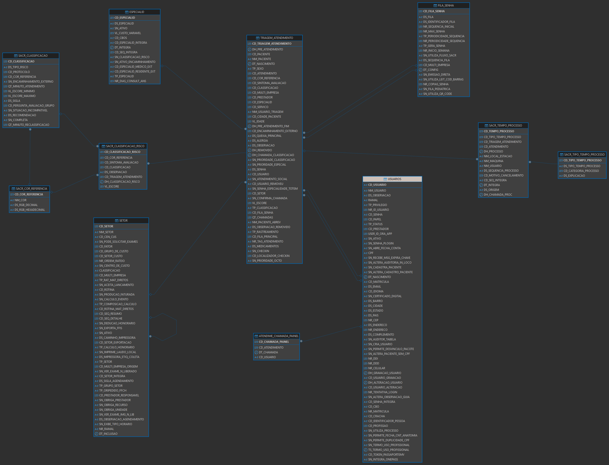

Revisão dos Indicadores do HPC-CLINICA-Tempo Médio de Atendimento
=============================================================

<br>
<br>

# O painel apresenta KPI e Indicadores relacionados ao acompanhamento do tempo de atendimento no hospital.

<br>
<br>

- ## **As metricas acompanhadas são:**

    <details open>
    <summary><strong>TE Consulta:</strong></summary>
    <p></p>

    - É o tempo médio de ESPERA para CHAMADA de Exames de Imagem, Laboratório ou Atedimento Médico;
    - No painel foi calculado com a formula DAX abaixo e o cálculo da média de forma implícita:
        ```sql
            IF(
                'Tempo de Processo'[IMG_FINAL],
                DATEDIFF('Tempo de Processo'[ADM_FINAL],'Tempo de Processo'[IMG_CHAMADA],MINUTE),
                IF(
                    'Tempo de Processo'[LAB_FINAL],
                    DATEDIFF('Tempo de Processo'[ADM_FINAL],'Tempo de Processo'[LAB_CHAMADA],MINUTE),
                    DATEDIFF('Tempo de Processo'[ADM_FINAL],'Tempo de Processo'[MÉD_CHAMADA],MINUTE)
            ))
        ```

        > Sobre o cálculo:

        - A formula verifica se existe TEMPO FINAL do **Exame de Imagem**,  então calcula a diferença entre o TEMPO FINAL
        DO ATENDIMENTO ADMNISTRATIVO DA RECEPÇÃO e o TEMPO CHAMADA DO EXAME DE IMAGEM em minutos.
        - Caso a condição NÃO seja satisfeita, é feita nova verificação sobre o TEMPO FINAL do **Exame de Labotório** para
        calcular a diferença entre o TEMPO FINAL DO ATENDIMENTO ADMINISTRATIVO DA RECEPÇÃO e o TEMPO DE CHAMADADA DO EXAME DE
        LABORATÓRIO em minutos.
        - Quando nenhuma das condições é satisfeita, é calculado a diferença entre o TEMPO FINAL DO ATENDIMENTO ADMINISTRATIVO DA
        RECEPÇÃO e o TEMPO DE CHAMADA DO ATENDIMENTO MEDICO em minutos.
    </details>

    <br>
    <br>

    <details open>
    <summary><strong>TA Consulta:</strong></summary>
    <p></p>

    - Tempo Médio de ATENDIMENTO para realização de Exames de Imagem, Laboratório ou Atedimento Médico;
    - No painel foi calculado com a formula DAX abaixo e o cálculo da média de forma implícita:
        ```sql
            IF(
                'Tempo de Processo'[IMG_FINAL],
                DATEDIFF('Tempo de Processo'[IMG_INÍCIO],'Tempo de Processo'[IMG_FINAL],MINUTE),
                IF(
                    'Tempo de Processo'[LAB_FINAL],
                    DATEDIFF('Tempo de Processo'[LAB_INÍCIO],'Tempo de Processo'[LAB_FINAL],MINUTE),
                    DATEDIFF('Tempo de Processo'[MÉD_CHAMADA],'Tempo de Processo'[MÉD_FINAL],MINUTE)
            ))
        ```

        > Sobre o cálculo:

        - A formula verifica se existe TEMPO FINAL do **Exame de Imagem** e então calcula a diferença entre o TEMPO INICIAL e
        FINAL DO EXAME DE IMAGEM em minutos;
        - Caso a condição NÃO seja satisfeita, é feita nova verificação sobre o TEMPO FINAL do **Exame de Labotório** para então
        calcular a diferença entre o TEMPO INICIAL e o TEMPO FINAL DO EXAME em minutos.
        - Quando nenhuma das condições é satisfeita, é calculada a diferença entre o TEMPO CHAMADA DO MEDICO e o TEMPO FINAL DO MEDICO
        em minutos.

    </details>

    <br>
    <br>

    <details open>
    <summary><strong>TE Guichê:</strong></summary>
    <p></p>

    - É o tempo médio de ESPERA para o Guichê realizar a CHAMADA para o atendimento administrativo da recepção;
    - No painel foi calculado com a formula DAX abaixo e o cálculo da média de forma implícita:
        ```sql
            DATEDIFF('Tempo de Processo'[CAD_TOTEM],'Tempo de Processo'[ADM_CHAMADA],MINUTE)
        ```

        > Sobre o cálculo:

        - A formula calcula a diferença entre o TEMPO CADASTRO NO TOTEM e o TEMPO DE CHAMADA DO ATENDIMENTO ADMINISTRATIVO DA RECEPÇÃO

    </details>

    <br>
    <br>

    <details open>
    <summary><strong>TA Guichê:</strong></summary>
    <p></p>

    - É o tempo médio de ATENDIMENTO para o guichê realizar o ATENDIMENTO administrativo da recepção;
    - No painel foi calculado com a formula DAX abaixo e o cálculo da média de forma implícita:
        ```sql
            DATEDIFF('Tempo de Processo'[ADM_INÍCIO],'Tempo de Processo'[ADM_FINAL],MINUTE)
        ```

        > Sobre o cálculo:

        - A formula calcula a diferença entre o TEMPO INICIO DO ATENDIMENTO ADMINISTRATIVO DA RECEPÇÃO e o
        TEMPO CHAMADA DO ATENDIMENTO ADMINISTRATIVO DA RECEPÇÃO

    </details>

    <br>
    <br>

> [!IMPORTANT]
> No painel os calculos podem são agrupados poor:

- Granularidade de Tempor (Mês, Trimmestre e Ano);
- Por Atendente;
- Por Médico;
- Por Clinica;
- Por Prioridade do Paciente;
- Também é fornecida visões mais análiticas,

    <br>
    <br>


> [!CAUTION]
> CONSIDERAÇÕES:

- A forma como os cálculos foram criados apresenta falha lógica, pois retorna apenas um dos valores que serão manipulados por CROSS FILTER
nos visuais, e isso não evidência os tempos entre as etapas exatas de cada tipo de atendimento, pois espera-se o tempo entre os processos que
compõem o fluxo de atendimento, independentemente do tipo de fila.


<br>
<br>

<br>
<br>

# Querys do painel


- ## **Modelo ER:**

    

    <br>
    <br>

- ## **Querys:**

    <details open>
        <summary><strong>Query 'Tempo de Processo:'</strong></summary>
        <p></p>

    - A tabela `sacr_tempo_processo` contém os tempos iniciais e finais de cada processo.
    - A tabela `sacr_tipo_tempo_processo` contém a descrição de cada processo.
    - A query abaixo retorna os MAIORES tempos dos atendimentos que chegaram a ser abertos com *´CD_ATENDIMENTO´*
    - Aparente o objetivo era retornar os maiores tempos entre os processos de atendimento ambulatorial (apenas exames)
    para permitir realizar o calculo de tempo entre as etapas no painel.


    ```sql
        SELECT
        stp.cd_triagem_atendimento,
        stp.cd_atendimento,
        MAX(CASE WHEN sttp.ds_tipo_tempo_processo = 'CADASTRO NO TOTEM' THEN stp.dh_processo END) AS cad_totem,
        MAX(CASE WHEN sttp.ds_tipo_tempo_processo = 'ATENDIMENTO ADMINISTRATIVO CHAMADA' THEN stp.dh_processo END) AS adm_chamada,
        MAX(CASE WHEN sttp.ds_tipo_tempo_processo = 'ATENDIMENTO ADMINISTRATIVO INÍCIO' THEN stp.dh_processo END) AS adm_início,
        MAX(CASE WHEN sttp.ds_tipo_tempo_processo = 'ATENDIMENTO ADMINISTRATIVO FINAL' THEN stp.dh_processo END) AS adm_final,
        MAX(CASE WHEN sttp.ds_tipo_tempo_processo = 'ATENDIMENTO MÉDICO CHAMADA' THEN stp.dh_processo END) AS méd_chamada,
        MAX(CASE WHEN sttp.ds_tipo_tempo_processo = 'ATENDIMENTO MÉDICO INÍCIO' THEN stp.dh_processo END) AS méd_início,
        MAX(CASE WHEN sttp.ds_tipo_tempo_processo = 'ATENDIMENTO MÉDICO ALTA' THEN stp.dh_processo END) AS méd_alta,
        MAX(CASE WHEN sttp.ds_tipo_tempo_processo = 'ATENDIMENTO MÉDICO FINAL' THEN stp.dh_processo END) AS méd_final,
        MAX(CASE WHEN sttp.ds_tipo_tempo_processo = 'EXAME IMAGEM CHAMADA' THEN stp.dh_processo END) AS img_chamada,
        MAX(CASE WHEN sttp.ds_tipo_tempo_processo = 'EXAME DE IMAGEM INÍCIO' THEN stp.dh_processo END) AS img_início,
        MAX(CASE WHEN sttp.ds_tipo_tempo_processo = 'EXAME DE IMAGEM FINAL' THEN stp.dh_processo END) AS img_final,
        MAX(CASE WHEN sttp.ds_tipo_tempo_processo = 'EXAME LABORATORIAL INÍCIO' THEN stp.dh_processo END) AS lab_início,
        MAX(CASE WHEN sttp.ds_tipo_tempo_processo = 'EXAME LABORATORIAL CHAMADA' THEN stp.dh_processo END) AS lab_chamada,
        MAX(CASE WHEN sttp.ds_tipo_tempo_processo = 'EXAME LABORATORIAL FINAL' THEN stp.dh_processo END) AS lab_final
        FROM sacr_tempo_processo stp
        LEFT JOIN sacr_tipo_tempo_processo sttp ON stp.cd_tipo_tempo_processo = sttp.cd_tipo_tempo_processo
        WHERE stp.cd_atendimento IS NOT NULL
        AND stp.cd_triagem_atendimento IS NOT NULL
        GROUP BY stp.cd_triagem_atendimento, stp.cd_atendimento ;

    ```

    <br>
    <br>


    > CONSIDERAÇÕES:

    - Query não permite calcular com precisão os KPI relacionados aos tempos entre os processos de forma real, pois além de
    não retorna todos os atendimentos, até mesmo aqueles que não tem **´CD_ATENDIMENTO´**, omite as linhas necessárias
    para calcular os tempos entre cada um dos processos das filas que são geradas nos atendimentos.

    <br>
    <br>

    **RESULTADO:**
    <table style="width:100%; border-collapse: collapse; text-align: left;">
        <thead>
            <tr style="background-color: #4CAF50; color: white;">
                <th style="padding: 8px; border: 1px solid #ddd;">Name</th>
                <th style="padding: 8px; border: 1px solid #ddd;">Value</th>
            </tr>
        </thead>
        <tbody>
            <tr style="background-color: #f2f2f2;">
                <td style="padding: 8px; border: 1px solid #ddd;">CD_TRIAGEM_ATENDIMENTO</td>
                <td style="padding: 8px; border: 1px solid #ddd;">263140</td>
            </tr>
            <tr>
                <td style="padding: 8px; border: 1px solid #ddd;">CD_ATENDIMENTO</td>
                <td style="padding: 8px; border: 1px solid #ddd;">203689</td>
            </tr>
            <tr style="background-color: #f2f2f2;">
                <td style="padding: 8px; border: 1px solid #ddd;">CAD_TOTEM</td>
                <td style="padding: 8px; border: 1px solid #ddd;">2025-03-22 16:46:26.000</td>
            </tr>
            <tr>
                <td style="padding: 8px; border: 1px solid #ddd;">ADM_CHAMADA</td>
                <td style="padding: 8px; border: 1px solid #ddd;"></td>
            </tr>
            <tr style="background-color: #f2f2f2;">
                <td style="padding: 8px; border: 1px solid #ddd;">ADM_INÍCIO</td>
                <td style="padding: 8px; border: 1px solid #ddd;">2025-03-22 16:46:49.000</td>
            </tr>
            <tr>
                <td style="padding: 8px; border: 1px solid #ddd;">ADM_FINAL</td>
                <td style="padding: 8px; border: 1px solid #ddd;">2025-03-22 16:51:51.000</td>
            </tr>
            <tr style="background-color: #f2f2f2;">
                <td style="padding: 8px; border: 1px solid #ddd;">MÉD_CHAMADA</td>
                <td style="padding: 8px; border: 1px solid #ddd;">2025-03-22 19:12:10.000</td>
            </tr>
            <tr>
                <td style="padding: 8px; border: 1px solid #ddd;">MÉD_INÍCIO</td>
                <td style="padding: 8px; border: 1px solid #ddd;">2025-03-22 17:15:00.000</td>
            </tr>
            <tr style="background-color: #f2f2f2;">
                <td style="padding: 8px; border: 1px solid #ddd;">MÉD_ALTA</td>
                <td style="padding: 8px; border: 1px solid #ddd;"></td>
            </tr>
            <tr>
                <td style="padding: 8px; border: 1px solid #ddd;">MÉD_FINAL</td>
                <td style="padding: 8px; border: 1px solid #ddd;">2025-03-22 17:17:20.000</td>
            </tr>
            <tr style="background-color: #f2f2f2;">
                <td style="padding: 8px; border: 1px solid #ddd;">IMG_CHAMADA</td>
                <td style="padding: 8px; border: 1px solid #ddd;"></td>
            </tr>
            <tr>
                <td style="padding: 8px; border: 1px solid #ddd;">IMG_INÍCIO</td>
                <td style="padding: 8px; border: 1px solid #ddd;"></td>
            </tr>
            <tr style="background-color: #f2f2f2;">
                <td style="padding: 8px; border: 1px solid #ddd;">IMG_FINAL</td>
                <td style="padding: 8px; border: 1px solid #ddd;"></td>
            </tr>
            <tr>
                <td style="padding: 8px; border: 1px solid #ddd;">LAB_INÍCIO</td>
                <td style="padding: 8px; border: 1px solid #ddd;"></td>
            </tr>
            <tr style="background-color: #f2f2f2;">
                <td style="padding: 8px; border: 1px solid #ddd;">LAB_CHAMADA</td>
                <td style="padding: 8px; border: 1px solid #ddd;"></td>
            </tr>
            <tr>
                <td style="padding: 8px; border: 1px solid #ddd;">LAB_FINAL</td>
                <td style="padding: 8px; border: 1px solid #ddd;"></td>
            </tr>
        </tbody>
    </table>


    <br>
    <br>

    <br>
    <br>


</details>


Refatoração:
=============================================================

<details open>
    <summary><strong>Refatoração</strong></summary>
    <p></p>

```sql
    WITH TEMPO_TOTEM_CLASS_ADM_MED
        AS (
            SELECT
                stp.CD_TEMPO_PROCESSO ,
                stp.CD_TRIAGEM_ATENDIMENTO ,
                stp.CD_ATENDIMENTO ,
                stp.CD_TIPO_TEMPO_PROCESSO ,
                stp.DH_PROCESSO
            FROM
                DBAMV.SACR_TEMPO_PROCESSO stp
    ),
    TIPO_PROCESSO
        AS (
            SELECT
                sttp.CD_TIPO_TEMPO_PROCESSO ,
                sttp.DS_TIPO_TEMPO_PROCESSO
            FROM
                DBAMV.SACR_TIPO_TEMPO_PROCESSO sttp
    ),
    TRIAGEM
        AS (
            SELECT
                ta.CD_TRIAGEM_ATENDIMENTO ,
                ta.CD_ATENDIMENTO ,
                ta.CD_FILA_SENHA ,
                ta.CD_FILA_PRINCIPAL ,
                ta.CD_SETOR ,
                ta.DH_PRE_ATENDIMENTO ,
                ta.DH_PRE_ATENDIMENTO_FIM ,
                ta.DH_CHAMADA_CLASSIFICACAO ,
                ta.DH_REMOVIDO
            FROM DBAMV.TRIAGEM_ATENDIMENTO ta
    ),
    FILA
        AS (
            SELECT
                fs.CD_FILA_SENHA ,
                fs.DS_FILA ,
                fs.DS_IDENTIFICADOR_FILA
            FROM DBAMV.FILA_SENHA fs
    ),
    CLASSIFICACAO_RISCO
        AS (
            SELECT
                scr.CD_TRIAGEM_ATENDIMENTO ,
                scr.CD_CLASSIFICACAO_RISCO ,
                scr.CD_CLASSIFICACAO ,
                scr.CD_COR_REFERENCIA ,
                scr.DH_CLASSIFICACAO_RISCO
            FROM DBAMV.SACR_CLASSIFICACAO_RISCO scr
    ),
    CLASSIFICACAO
        AS (
            SELECT
                sc.CD_CLASSIFICACAO ,
                sc.DS_TIPO_RISCO
            FROM DBAMV.SACR_CLASSIFICACAO sc
    ),
    COR
        AS (
            SELECT
                scr.CD_COR_REFERENCIA ,
                scr.NM_COR ,
                scr.DS_RGB_DECIMAL ,
                scr.DS_RGB_HEXADECIMAL
            FROM DBAMV.SACR_COR_REFERENCIA scr
    )
    SELECT
        tcam.CD_TRIAGEM_ATENDIMENTO,
        tcam.CD_ATENDIMENTO ,
        tcam.DH_PROCESSO ,
        EXTRACT(MONTH FROM tcam.DH_PROCESSO) AS MES ,
        EXTRACT(YEAR FROM tcam.DH_PROCESSO)  AS ANO ,
        LAG(tcam.DH_PROCESSO) OVER (PARTITION BY tcam.CD_TRIAGEM_ATENDIMENTO ORDER BY tcam.DH_PROCESSO) AS PREV_DH_PROCESSO,
        ROUND((tcam.DH_PROCESSO - LAG(tcam.DH_PROCESSO) OVER (PARTITION BY tcam.CD_TRIAGEM_ATENDIMENTO ORDER BY tcam.DH_PROCESSO)) * 24 * 60, 2) AS INTERVALO_TEMPO,
        tp.DS_TIPO_TEMPO_PROCESSO ,
        tri.DH_PRE_ATENDIMENTO ,
        tri.DH_PRE_ATENDIMENTO_FIM ,
        tri.DH_CHAMADA_CLASSIFICACAO ,
        tri.DH_REMOVIDO ,
        fs.DS_FILA ,
        CASE WHEN fs.CD_FILA_SENHA IN(2, 21, 3, 20) THEN
            'CLINICA 1'
            WHEN fs.CD_FILA_SENHA IN(12, 22, 13, 19) THEN
            'CLINICA 2'
            WHEN fs.CD_FILA_SENHA = 1 THEN
                'URGENCIA/EMERGENCIA'
        ELSE NULL END AS CLINICA ,
        CASE WHEN fs.CD_FILA_SENHA IN(2, 21, 12, 22) THEN
            'CONSULTA'
            WHEN fs.CD_FILA_SENHA IN(3, 20, 13, 19) THEN
            'EXAME'
        ELSE NULL END AS ATEND_AMBULATORIAL ,
        sc.DS_TIPO_RISCO ,
        co.NM_COR
    FROM TEMPO_TOTEM_CLASS_ADM_MED tcam
    INNER JOIN TIPO_PROCESSO tp ON tcam.CD_TIPO_TEMPO_PROCESSO = tp.CD_TIPO_TEMPO_PROCESSO
    INNER JOIN TRIAGEM tri ON tcam.CD_TRIAGEM_ATENDIMENTO = tri.CD_TRIAGEM_ATENDIMENTO
    LEFT JOIN FILA fs ON tri.CD_FILA_SENHA = fs.CD_FILA_SENHA
    LEFT JOIN CLASSIFICACAO_RISCO scr ON tri.CD_TRIAGEM_ATENDIMENTO = scr.CD_TRIAGEM_ATENDIMENTO
    LEFT JOIN CLASSIFICACAO sc ON scr.CD_CLASSIFICACAO = sc.CD_CLASSIFICACAO
    LEFT JOIN COR co ON scr.CD_COR_REFERENCIA = co.CD_COR_REFERENCIA
    ORDER BY tcam.CD_TRIAGEM_ATENDIMENTO desc, tcam.DH_PROCESSO;
```
<br>
<br>

**RESULTADO CORRETO:**

<table style="width:100%; border-collapse: collapse; text-align: left;">
    <thead>
        <tr style="background-color: #4CAF50; color: white;">
            <th style="padding: 8px; border: 1px solid #ddd;">CD_TRIAGEM_ATENDIMENTO</th>
            <th style="padding: 8px; border: 1px solid #ddd;">CD_ATENDIMENTO</th>
            <th style="padding: 8px; border: 1px solid #ddd;">DS_TIPO_TEMPO_PROCESSO</th>
            <th style="padding: 8px; border: 1px solid #ddd;">DH_PROCESSO</th>
            <th style="padding: 8px; border: 1px solid #ddd;">INTERVALO_TEMPO</th>
        </tr>
    </thead>
    <tbody>
        <tr style="background-color: #f2f2f2;">
            <td style="padding: 8px; border: 1px solid #ddd;">263140</td>
            <td style="padding: 8px; border: 1px solid #ddd;">203689</td>
            <td style="padding: 8px; border: 1px solid #ddd;">CADASTRO NO TOTEM</td>
            <td style="padding: 8px; border: 1px solid #ddd;">2025-03-22 16:46:26.000</td>
            <td style="padding: 8px; border: 1px solid #ddd;"></td>
        </tr>
        <tr>
            <td style="padding: 8px; border: 1px solid #ddd;">263140</td>
            <td style="padding: 8px; border: 1px solid #ddd;">203689</td>
            <td style="padding: 8px; border: 1px solid #ddd;">ATENDIMENTO ADMINISTRATIVO INÍCIO</td>
            <td style="padding: 8px; border: 1px solid #ddd;">2025-03-22 16:46:49.000</td>
            <td style="padding: 8px; border: 1px solid #ddd;">0.38</td>
        </tr>
        <tr style="background-color: #f2f2f2;">
            <td style="padding: 8px; border: 1px solid #ddd;">263140</td>
            <td style="padding: 8px; border: 1px solid #ddd;">203689</td>
            <td style="padding: 8px; border: 1px solid #ddd;">ATENDIMENTO ADMINISTRATIVO FINAL</td>
            <td style="padding: 8px; border: 1px solid #ddd;">2025-03-22 16:51:51.000</td>
            <td style="padding: 8px; border: 1px solid #ddd;">5.03</td>
        </tr>
        <tr>
            <td style="padding: 8px; border: 1px solid #ddd;">263140</td>
            <td style="padding: 8px; border: 1px solid #ddd;">203689</td>
            <td style="padding: 8px; border: 1px solid #ddd;">ATENDIMENTO MÉDICO INÍCIO</td>
            <td style="padding: 8px; border: 1px solid #ddd;">2025-03-22 17:15:00.000</td>
            <td style="padding: 8px; border: 1px solid #ddd;">23.15</td>
        </tr>
        <tr style="background-color: #f2f2f2;">
            <td style="padding: 8px; border: 1px solid #ddd;">263140</td>
            <td style="padding: 8px; border: 1px solid #ddd;">203689</td>
            <td style="padding: 8px; border: 1px solid #ddd;">ATENDIMENTO MÉDICO FINAL</td>
            <td style="padding: 8px; border: 1px solid #ddd;">2025-03-22 17:17:20.000</td>
            <td style="padding: 8px; border: 1px solid #ddd;">2.33</td>
        </tr>
        <tr>
            <td style="padding: 8px; border: 1px solid #ddd;">263140</td>
            <td style="padding: 8px; border: 1px solid #ddd;">203689</td>
            <td style="padding: 8px; border: 1px solid #ddd;">ATENDIMENTO MÉDICO CHAMADA</td>
            <td style="padding: 8px; border: 1px solid #ddd;">2025-03-22 19:12:10.000</td>
            <td style="padding: 8px; border: 1px solid #ddd;">114.83</td>
        </tr>
    </tbody>
</table>


</details>
