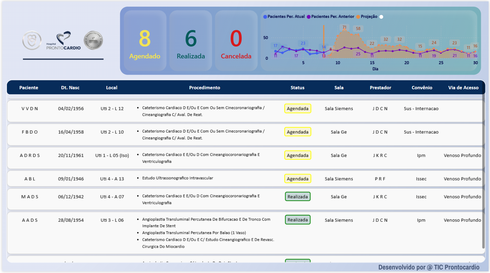

PAINEL PARA EXIBIÇÃO DE PACIENTES E PROCEDIMENTOS - HEMODINACA
===

<br>
<br>

### STACKS:

[](https://cx.oracletutorial.com/oracle-net/thick-vs-thin-driver/)
[](https://dbeaver.io/)


---


<br>
<br>

# Objetivo desse dashboard é apresentar a relação de procedimentos agrupada por paciente, identificando-o, por local, status, convênio e tipo de via de acesso de forma interativa sem necessidade de manuseio, pois será exibido em TV.

<br>
<br>


## QUERYS

<br>

<details>
    <summary><strong>QUERY ORIGINAL PRESENTE NO PAINEL DO PRONTO SISTEMA</strong></summary>
    <p></p>

```sql
WITH V_HPC_HEMODIN_V4
    AS (
        SELECT --rownum as ID,
            ac.cd_paciente||'_'||ac.dt_aviso_cirurgia CHAVE,
            INITCAP(pr.nm_prestador) Prestador,
            INITCAP(am.ds_ati_med) Atividade,
            TO_CHAR(ac.dt_aviso_cirurgia,'DD/MM/YYYY') dt_aviso_cirurgia,
            TO_CHAR(ac.dt_aviso_cirurgia,'HH:MI:SS') hr_aviso_cirurgia,
            TO_CHAR(ac.dt_agendamento,'DD/MM/YYYY') dt_agendamento,
            TO_CHAR(ac.dt_agendamento,'HH:MI:SS') hr_agendamento,
            ac.dt_inicio_cirurgia,
            ac.dt_saida_sal_cir,
            INITCAP(sr.ds_sal_cir) Sala,
            ac.cd_paciente,
            INITCAP(ac.nm_paciente) Paciente,
            TO_CHAR(p.dt_nascimento,'DD/MM/YYYY') dt_nascimento,
            ac.ds_idade Idade,
            INITCAP(c.ds_cirurgia) Procedimento,
            DECODE(ac.tp_situacao, 'A', 'Em Aviso', 'R', 'Realizada','C','Cancelada','G','Agendada','T','Controle de Checagem','P','Pré Atendimento', 'NÃO IDENTIFICADO') Situação,
            INITCAP(co.nm_convenio) Convênio,
            ac.ds_obs_aviso Observação
        FROM dbamv.prestador_aviso pa,
            dbamv.aviso_cirurgia ac,
            dbamv.cirurgia_aviso ca,
            dbamv.ati_med am,
            dbamv.cirurgia c,
            dbamv.convenio co,
            dbamv.sal_cir sr,
            dbamv.prestador pr,
            dbamv.paciente p
        WHERE ac.cd_aviso_cirurgia = pa.cd_aviso_cirurgia
            AND ca.cd_cirurgia_aviso = pa.cd_cirurgia_aviso
            AND ac.cd_aviso_cirurgia = ca.cd_aviso_cirurgia
            AND ca.cd_cirurgia_aviso = pa.cd_cirurgia_aviso
            AND sr.cd_sal_cir = ac.cd_sal_cir
            AND c.cd_cirurgia = ca.cd_cirurgia
            AND co.cd_convenio = ca.cd_convenio
            AND pa.cd_ati_med = am.cd_ati_med
            AND pa.cd_prestador = pr.cd_prestador
            AND pa.sn_principal = 'S'
            AND ac.cd_cen_cir IN ('1','2')
            AND ac.cd_paciente = p.cd_paciente
        ORDER BY 1,10 DESC
)
SELECT
    *
FROM V_HPC_HEMODIN_V4
WHERE dt_aviso_cirurgia BETWEEN TRUNC(SYSDATE) AND TRUNC(SYSDATE) + 0.99999
;

```

</details>

<br>

<details >
    <summary><strong>QUERY PARA AGREGAR QUANTITATIVOS DE PROCEDIMENTOS e PACIENTES NO MES ATUAL</strong></summary>
    <p></p>

```sql
WITH V_HPC_HEMODIN_V4 AS (
    SELECT
        pr.cd_prestador,
        INITCAP(SUBSTR(pr.nm_prestador, 1, 255)) AS nm_prestador,
        am.cd_ati_med,
        INITCAP(SUBSTR(am.ds_ati_med, 1, 255)) AS nm_atividade,
        ac.dt_aviso_cirurgia,
        ac.dt_agendamento,
        ac.dt_inicio_cirurgia,
        ac.dt_saida_sal_cir,
        sr.cd_sal_cir,
        INITCAP(SUBSTR(sr.ds_sal_cir, 1, 255)) AS sala,
        ac.cd_paciente,
        INITCAP(SUBSTR(ac.nm_paciente, 1, 255)) AS nm_aciente,
        TRUNC(p.dt_nascimento) AS dt_nascimento_paciente,
        ac.ds_idade,
        c.cd_cirurgia,
        INITCAP(SUBSTR(c.ds_cirurgia, 1, 255)) AS ds_cirurgia,
        ac.tp_situacao AS cd_tp_situacao,
        DECODE(
            ac.tp_situacao,
            'A', 'Em Aviso',
            'R', 'Realizada',
            'C', 'Cancelada',
            'G', 'Agendada',
            'T', 'Controle de Checagem',
            'P', 'Pré Atendimento',
            'Nao Identificado'
        ) AS nm_situacao,
        co.cd_convenio,
        INITCAP(SUBSTR(co.nm_convenio, 1, 255)) AS nm_convenio,
        ac.ds_obs_aviso AS observacao
    FROM
        dbamv.prestador_aviso pa
        JOIN dbamv.aviso_cirurgia ac ON ac.cd_aviso_cirurgia = pa.cd_aviso_cirurgia
        JOIN dbamv.cirurgia_aviso ca ON ca.cd_cirurgia_aviso = pa.cd_cirurgia_aviso
        JOIN dbamv.ati_med am ON pa.cd_ati_med = am.cd_ati_med
        JOIN dbamv.cirurgia c ON c.cd_cirurgia = ca.cd_cirurgia
        JOIN dbamv.convenio co ON co.cd_convenio = ca.cd_convenio
        JOIN dbamv.sal_cir sr ON sr.cd_sal_cir = ac.cd_sal_cir
        JOIN dbamv.prestador pr ON pa.cd_prestador = pr.cd_prestador
        JOIN dbamv.paciente p ON ac.cd_paciente = p.cd_paciente
    WHERE
        pa.sn_principal = 'S'
        AND ac.cd_cen_cir IN ('1', '2')
    ORDER BY 1, 10 DESC
),
AGREGADO_PACIENTE AS (
    SELECT
        nm_aciente AS Paciente,
        dt_nascimento_paciente AS Dt_Nasc,
        ds_idade AS Idade,
        nm_situacao AS Status,
        sala AS Sala,
        nm_prestador,
        nm_convenio AS Convênio,
        dt_aviso_cirurgia,
        dt_agendamento,
        dt_inicio_cirurgia,
        dt_saida_sal_cir,
        ds_cirurgia AS Procedimento,
        observacao AS Observação
    FROM
        V_HPC_HEMODIN_V4
    WHERE
        TO_CHAR(dt_aviso_cirurgia, 'MM/YYYY') = TO_CHAR(SYSDATE, 'MM/YYYY')
)
SELECT
    *
FROM
    AGREGADO_PACIENTE
ORDER BY
    Status ASC
;
```

</details>


<br>

<details>
    <summary><strong>QUERY DOS PROCEDIMENTOS A SER REALIZADOS NO DIA ATUAL</strong></summary>
    <p></p>

```sql
WITH V_HPC_HEMODIN_V4 AS (
    SELECT
        pr.cd_prestador,
        vda.ds_via_de_acesso AS via_acesso,
        l.ds_leito AS leito,
        ui.ds_unid_int AS unidade_internacao,
        INITCAP(SUBSTR(pr.nm_prestador, 1, 255)) AS nm_prestador,
        am.cd_ati_med,
        INITCAP(SUBSTR(am.ds_ati_med, 1, 255)) AS nm_atividade,
        ac.dt_aviso_cirurgia,
        ac.dt_agendamento,
        ac.dt_inicio_cirurgia,
        ac.dt_saida_sal_cir,
        sr.cd_sal_cir,
        INITCAP(SUBSTR(sr.ds_sal_cir, 1, 255)) AS sala,
        ac.cd_paciente,
        INITCAP(SUBSTR(ac.nm_paciente, 1, 255)) AS nm_paciente,
        TRUNC(p.dt_nascimento) AS dt_nascimento_paciente,
        ac.ds_idade,
        c.cd_cirurgia,
        INITCAP(SUBSTR(c.ds_cirurgia, 1, 255)) AS ds_cirurgia,
        ac.tp_situacao AS cd_tp_situacao,
        DECODE(
            ac.tp_situacao,
            'A', 'Em Aviso',
            'R', 'Realizada',
            'C', 'Cancelada',
            'G', 'Agendada',
            'T', 'Controle de Checagem',
            'P', 'Pré Atendimento',
            'Nao Identificado'
        ) AS nm_situacao,
        co.cd_convenio,
        INITCAP(SUBSTR(co.nm_convenio, 1, 255)) AS nm_convenio,
        ac.ds_obs_aviso AS observacao
    FROM
        dbamv.prestador_aviso pa
        JOIN dbamv.aviso_cirurgia ac ON ac.cd_aviso_cirurgia = pa.cd_aviso_cirurgia
        JOIN dbamv.cirurgia_aviso ca ON ca.cd_cirurgia_aviso = pa.cd_cirurgia_aviso
        JOIN dbamv.ati_med am ON pa.cd_ati_med = am.cd_ati_med
        JOIN dbamv.cirurgia c ON c.cd_cirurgia = ca.cd_cirurgia
        JOIN dbamv.convenio co ON co.cd_convenio = ca.cd_convenio
        JOIN dbamv.sal_cir sr ON sr.cd_sal_cir = ac.cd_sal_cir
        JOIN dbamv.prestador pr ON pa.cd_prestador = pr.cd_prestador
        JOIN dbamv.paciente p ON ac.cd_paciente = p.cd_paciente
        JOIN dbamv.atendime a ON ac.cd_atendimento = a.cd_atendimento
        LEFT JOIN dbamv.leito l ON a.cd_leito = l.cd_leito
        LEFT JOIN dbamv.unid_int ui ON l.cd_unid_int = ui.cd_unid_int
        LEFT JOIN dbamv.via_de_acesso vda ON ca.cd_via_de_acesso = vda.cd_via_de_acesso
    WHERE
        pa.sn_principal = 'S'
        AND ac.cd_cen_cir IN ('1', '2')
    ORDER BY 1, 10 DESC
),
AGREGADO_PACIENTE AS (
    SELECT
        nm_paciente AS Paciente,
        dt_nascimento_paciente AS "Dt. Nasc",
        ds_idade AS Idade,
        nm_situacao AS Status,
        sala AS Sala,
        nm_prestador AS Prestador,
        CAST(' ' AS VARCHAR(2)) AS "Via de Acesso",
        INITCAP(unidade_internacao || ' - ' || leito) AS "Local",
        nm_convenio AS Convênio,
        dt_aviso_cirurgia,
        dt_agendamento,
        dt_inicio_cirurgia,
        dt_saida_sal_cir,
        LISTAGG(ds_cirurgia, CHR(10)) WITHIN GROUP (ORDER BY ds_cirurgia) AS Procedimento,
        LISTAGG(observacao, CHR(10)) WITHIN GROUP (ORDER BY observacao) AS Observação
    FROM
        V_HPC_HEMODIN_V4
    WHERE
        dt_aviso_cirurgia BETWEEN TRUNC(SYSDATE) AND TRUNC(SYSDATE) + 0.99999
    GROUP BY
        nm_paciente,
        dt_nascimento_paciente,
        ds_idade,
        nm_situacao,
        sala,
        nm_prestador,
        via_acesso,
        unidade_internacao || ' - ' || leito,
        nm_convenio,
        dt_aviso_cirurgia,
        dt_agendamento,
        dt_inicio_cirurgia,
        dt_saida_sal_cir
)
SELECT
    *
FROM
    AGREGADO_PACIENTE
ORDER BY
    Status ASC
;
```

</details>

<br>


---

<br>
<br>

# DASHBOARD POWERBI

<br>

[](https://app.powerbi.com/view?r=eyJrIjoiYzUyZjExMzctYmI0Ni00ZWI5LTg1N2QtYjU2MDE4Nzg4N2EzIiwidCI6ImIyZTIzZTI3LWVmYzItNDEwOC1iN2E5LWQ5ODczYmE2MzEyMSJ9)

### * Esse painel apresenta os dados da tabela em movimento como um rolo em movimento -- Click na imagem.