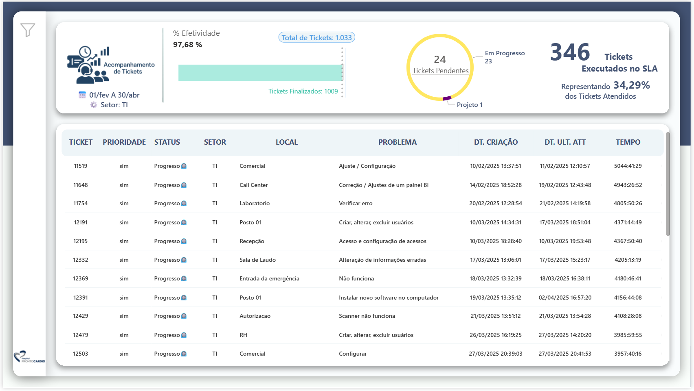

QUERY PAINEL DE ACOMPANHAMENTO DE TICKETS
====================

<br>
<br>

### STACKS:


[](https://dbeaver.io/)


---


<br>
<br>


<details open>
    <summary><strong>QUERY TICKETS</strong></summary>
    <p></p>

```sql
SELECT
    ptc.id,
    ag.name,
    ptc.titulo AS titulo_chamado,
    ptc.email AS email_salario,
    ptc.telefone,
    ptc.prioridade,
    ptc.created_at,
    ptc.dt_finalizado,
    ptc.updated_at,
    ptc.agend AS agendamento,
    pts.status,
    ptc.paciente AS afeta_paciente,
    ptc.m_sla AS sla,
    CASE
      WHEN ptc.t_co LIKE '%dias%' THEN ptc.t_co
      WHEN ptc.t_co LIKE '%dia%' THEN ptc.t_co
      ELSE CONCAT('0 dias, ', ptc.t_co)
    END tempo_decorrido,
    ptl.local local_de_ocorrencia,
    ptpro.problema,
    pttp.tipoProb AS tipo_problema,
    gcu_usuario.nome AS usuario,
    gcu_tecnico.nome AS tecnico,
    gcu_atendime.nome AS responsavel
FROM
    prontoticket_chamado ptc
LEFT JOIN
    prontoticket_local ptl ON ptc.local_setor_id = ptl.id
LEFT JOIN
    prontoticket_problema ptpro ON ptc.problema_id = ptpro.id
LEFT JOIN
    prontoticket_tipoproblema pttp ON ptc.tp_problema_id = pttp.id
LEFT JOIN
    gerenciamento_cod_usuario gcu_usuario ON gcu_usuario.id = ptc.usuario_id
LEFT JOIN
    gerenciamento_cod_usuario gcu_tecnico ON gcu_tecnico.id = ptc.tec_responsavel_id
LEFT JOIN
    gerenciamento_cod_usuario gcu_atendime ON gcu_atendime.id = ptc.usuario_atendime_id
LEFT JOIN
    prontoticket_status pts ON ptc.status_id = pts.id_status
LEFT JOIN
    prontoticket_tecnico ptt ON ptc.tec_responsavel_id = ptt.usuario_id
LEFT JOIN
    auth_group ag ON ag.id = ptc.setor_recebe_id
WHERE YEAR(ptc.created_at) = YEAR(CURDATE())
;
```

</details>

<br>

---

<br>
<br>

# DASHBOARD POWERBI

<br>

[](https://app.powerbi.com/view?r=eyJrIjoiYjhiYTM4MmQtYTFiZC00NjczLWFhZjgtZThmYjRkM2E1NmRjIiwidCI6ImIyZTIzZTI3LWVmYzItNDEwOC1iN2E5LWQ5ODczYmE2MzEyMSJ9)

### * Esse painel apresenta os dados da tabela em movimento como um rolo em movimento -- Click na imagem.

