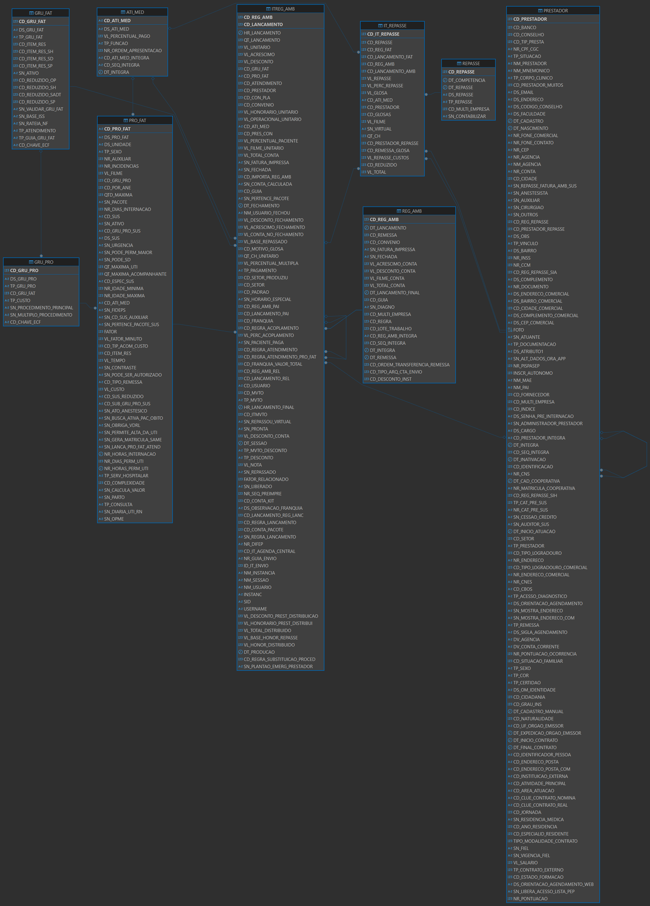
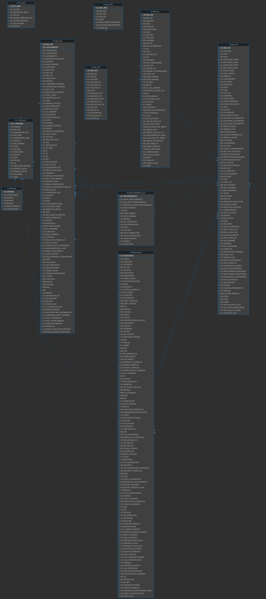

<details open>
    <summary><strong>Query Original da Consulta "FATURAMENTO" no painel HPC-FATURAMENTO-Repasse Médico:</strong></summary>
    <p></p>

```sql
    WITH CONSULTA_PBI_FATURAMENTO AS (
    SELECT
        NVL(ia.SN_REPASSADO, if.SN_REPASSADO) AS SN_REPASSADO,
        ia.CD_GRU_FAT,
        a.cd_atendimento cd_atendimento,
        c.nm_convenio convenio,
        DECODE(if.cd_reg_fat, NULL, 'AMBULATORIAL', 'HOSPITALAR') tipo_de_conta,
        NVL(if.cd_reg_fat,ia.cd_reg_amb) cd_reg,
        NVL(if.cd_lancamento,ia.cd_lancamento) cd_lancamento,
        NVL(ps.ds_procedimento,NVL(pf1.ds_pro_fat,pf2.ds_pro_fat))  descricao_servico,
        a.dt_atendimento,
        EXTRACT(MONTH FROM a.dt_atendimento) MES,
        EXTRACT(YEAR FROM a.dt_atendimento) ANO,
        TO_CHAR(a.dt_atendimento,'MM/YYYY') mes_atendimento,
        NVL(rf.cd_remessa,ra.cd_remessa) cd_remessa,
        NVL(TO_CHAR(rf.dt_remessa,'MM/YYYY'),TO_CHAR(ra.dt_remessa,'MM/YYYY')) dt_remessa,
        NVL(rs.dt_competencia,NVL(r1.dt_competencia,r2.dt_competencia)) dt_competencia,
        NVL(gp1.cd_gru_pro,gp2.cd_gru_pro) cd_gru_pro,
        NVL(gp1.ds_gru_pro,gp2.ds_gru_pro) ds_gru_pro,
        NVL(gf1.ds_gru_fat,gf2.ds_gru_fat) ds_gru_fat,
        NVL(irs.vl_total,NVL(if.vl_total_conta,ia.vl_total_conta)) vl_total_conta,
        NVL(irs.vl_repasse,NVL(ir1.vl_repasse,ir2.vl_repasse)) vl_repasse  ,
        NVL(am.ds_ati_med,NVL(am1.ds_ati_med,am2.ds_ati_med)) auxiliar
    FROM atendime a
        LEFT JOIN reg_fat rf ON rf.cd_atendimento = a.cd_atendimento
        LEFT JOIN itreg_fat if ON if.cd_reg_fat = rf.cd_reg_fat
        LEFT JOIN itreg_amb ia ON ia.cd_atendimento = a.cd_atendimento
        LEFT JOIN reg_amb ra ON ia.cd_reg_amb = ra.cd_reg_amb
        LEFT JOIN pro_fat pf1 ON pf1.cd_pro_fat = if.cd_pro_fat
        LEFT JOIN pro_fat pf2 ON pf2.cd_pro_fat = ia.cd_pro_fat
        LEFT JOIN procedimento_sus ps ON ps.cd_procedimento = if.cd_procedimento
        LEFT JOIN convenio c ON a.cd_convenio = c.cd_convenio
        LEFT JOIN paciente pa ON pa.cd_paciente = a.cd_paciente
        LEFT JOIN gru_pro gp1 ON gp1.cd_gru_pro = pf1.cd_gru_pro
        LEFT JOIN gru_pro gp2 ON gp2.cd_gru_pro = pf2.cd_gru_pro
        LEFT JOIN gru_fat gf1 ON gp1.cd_gru_fat = gf1.cd_gru_fat
        LEFT JOIN gru_fat gf2 ON gp2.cd_gru_fat = gf2.cd_gru_fat
        LEFT JOIN it_repasse ir1 ON ir1.cd_reg_fat = if.cd_reg_fat AND ir1.cd_lancamento_fat = if.cd_lancamento
        LEFT JOIN it_repasse ir2 ON ir2.cd_reg_amb = ia.cd_reg_amb AND ir2.cd_lancamento_amb = ia.cd_lancamento
        LEFT JOIN it_repasse_sih irs ON irs.cd_reg_fat = if.cd_reg_fat AND irs.cd_lancamento = if.cd_lancamento
        LEFT JOIN ati_med am ON am.CD_ATI_MED =  ir1.cd_ati_med
        LEFT JOIN ati_med am1 ON am1.CD_ATI_MED =  ir2.CD_ATI_MED
        LEFT JOIN ati_med am2 ON am2.CD_ATI_MED =  irs.CD_ATI_MED
        LEFT JOIN repasse r1 ON r1.cd_repasse = ir1.cd_repasse
        LEFT JOIN repasse r2 ON r2.cd_repasse = ir2.cd_repasse
        LEFT JOIN repasse rs ON rs.cd_repasse = irs.cd_repasse
        LEFT JOIN prestador p1 ON p1.cd_prestador = ir1.cd_prestador
        LEFT JOIN prestador p2 ON p2.cd_prestador = ir2.cd_prestador
        LEFT JOIN prestador p5 ON p5.cd_prestador = irs.cd_prestador_repasse
        LEFT JOIN prestador p3 ON p3.cd_prestador = if.cd_prestador
        LEFT JOIN prestador p4 ON p4.cd_prestador = ia.cd_prestador
    WHERE (rf.cd_reg_fat IS NOT NULL OR ra.cd_reg_amb IS NOT NULL)
        AND (gp1.cd_gru_pro <> 1 OR gp2.cd_gru_pro <> 1)
        AND (gp1.cd_gru_pro <> 2 OR gp2.cd_gru_pro <> 2)
        AND (gp1.cd_gru_pro <> 3 OR gp2.cd_gru_pro <> 3)
        AND (gp1.cd_gru_pro <> 4 OR gp2.cd_gru_pro <> 4)
        AND (gp1.cd_gru_pro <> 5 OR gp2.cd_gru_pro <> 5)
        AND (gp1.cd_gru_pro <> 6 OR gp2.cd_gru_pro <> 6)
        AND (gp1.cd_gru_pro <> 7 OR gp2.cd_gru_pro <> 7)
        AND (gp1.cd_gru_pro <> 8 OR gp2.cd_gru_pro <> 8)
        AND (gp1.cd_gru_pro <> 9 OR gp2.cd_gru_pro <> 9)
        AND (gp1.cd_gru_pro <> 11 OR gp2.cd_gru_pro <> 11)
        AND (gp1.cd_gru_pro <> 28 OR gp2.cd_gru_pro <> 28)
        AND (gp1.cd_gru_pro <> 75 OR gp2.cd_gru_pro <> 75)
        AND (gp1.cd_gru_pro <> 76 OR gp2.cd_gru_pro <> 76)
        AND (gp1.cd_gru_pro <> 77 OR gp2.cd_gru_pro <> 77)
        AND (gp1.cd_gru_pro <> 89 OR gp2.cd_gru_pro <> 89)
        AND (gp1.cd_gru_pro <> 90 OR gp2.cd_gru_pro <> 90)
        AND (gp1.cd_gru_pro <> 91 OR gp2.cd_gru_pro <> 91)
        AND (gp1.cd_gru_pro <> 92 OR gp2.cd_gru_pro <> 92)
        AND (gp1.cd_gru_pro <> 93 OR gp2.cd_gru_pro <> 93)
        AND (gp1.cd_gru_pro <> 95 OR gp2.cd_gru_pro <> 95)
        AND (gp1.cd_gru_pro <> 96 OR gp2.cd_gru_pro <> 96)
    )
    SELECT * FROM CONSULTA_PBI_FATURAMENTO ;
```
</details>
<p></p>
<p></p>

<details open>
    <summary><strong>Avaliação da Relação entre as tabelas IT_REPASSE e IT_REPASSE_SIH com  REPASSE</strong></summary>
    <p></p>

```sql
    SELECT
        ir.CD_REPASSE,
        ir.CD_REG_AMB,
        ir.CD_LANCAMENTO_AMB,
        ir.CD_REG_FAT,
        ir.CD_LANCAMENTO_FAT,
        ir.CD_ATI_MED,
        ir.CD_PRESTADOR_REPASSE,
        ir.VL_REPASSE,
        r.DT_COMPETENCIA,
        r.DT_REPASSE,
        r.TP_REPASSE
    FROM DBAMV.IT_REPASSE ir
    LEFT JOIN DBAMV.REPASSE r ON ir.CD_REPASSE = r.CD_REPASSE
```
<p></p>

```sql
    SELECT
        sih.CD_REPASSE,
        CAST(0 AS NUMBER(10,0)) AS CD_REG_AMB,
        CAST(0 AS NUMBER(10,0)) AS CD_LANCAMENTO_AMB,
        sih.CD_REG_FAT,
        sih.CD_LANCAMENTO AS CD_LANCAMENTO_FAT,
        sih.CD_ATI_MED,
        sih.CD_PRESTADOR_REPASSE,
        sih.VL_REPASSE,
        rish.DT_COMPETENCIA,
        rish.DT_REPASSE,
        rish.TP_REPASSE
    FROM DBAMV.IT_REPASSE_SIH sih
    LEFT JOIN DBAMV.REPASSE rish ON sih.CD_REPASSE = rish.CD_REPASSE
```


- **Resultado**:
    - Quando *'CD_GRUPO_FAT'* = 8 [PACOTES ESPECIAIS]
        - *'SN_REPASSADO'* será igual a "X" ou "N"
        - *'CD_PRESTADOR'* será null
        - *'VL_BASE_REPASSADO'* será null

    - Quando *'SN_REPASSADO'* = 'S'
        - É retornado apenas os registros com repasse 'realizados' aos médicos

</details>


<details open>
    <summary><strong>Avaliação da tabela ITREG_AMB</strong></summary>
    <p></p>


```sql
    SELECT
        ia.CD_REG_AMB,
        ia.CD_PRO_FAT,
        ia.CD_GRU_FAT,
        ia.CD_PRESTADOR,
        ia.CD_ATENDIMENTO,
        ia.CD_CONVENIO,
        ia.DT_FECHAMENTO,
        ia.HR_LANCAMENTO,
        ia.SN_FECHADA,
        ia.SN_REPASSADO,
        ia.SN_PERTENCE_PACOTE,
        ia.VL_UNITARIO,
        ia.VL_TOTAL_CONTA,
        ia.VL_BASE_REPASSADO
    FROM DBAMV.ITREG_AMB ia
    WHERE ia.CD_ATENDIMENTO IN(176642, 149423);
```

- **Resultado**:
    - Quando *'CD_GRUPO_FAT'* = 8 [PACOTES ESPECIAIS]
        - *'SN_REPASSADO'* será igual a "X" ou "N"
        - *'CD_PRESTADOR'* será null
        - *'VL_BASE_REPASSADO'* será null

    - Quando *`SN_REPASSADO'* = 'S'
        - É retornado apenas os registros com repasse 'realizados' aos médicos
<p></p>


</details>
<p></p>
<p></p>


<details open>
    <summary><strong>Itens Hospitalares para Exclusão do Repasse</strong></summary>
    <p></p>


```sql
    SELECT
        *
    FROM DBAMV.GRU_PRO
    WHERE CD_GRU_PRO IN(1, 2, 3, 4, 5, 6, 7, 8, 9, 11, 28, 75, 76, 77, 89, 90, 91, 92, 93, 95, 96) ;
```
- **Resultado**:
    - Itens hospitalares que devem ser EXCLUÍDOS do repasse aos médicos
    * Qual a melhor forma de excluí-los sem hardcode

</details>
<p></p>
<p></p>


<details open>
    <summary><strong>Avaliação da Relação entre as tabela "PRO_FAT" com  "ITREG_FAT" e "ITREG_AMB" </strong></summary>
    <p></p>


```sql
    -- TESTANDO RELAÇÃO DA TABELA PRO_FAT COM ITREG_AMB
    SELECT
        pf.CD_PRO_FAT,
        ia.CD_REG_AMB,
        ia.CD_PRO_FAT,
        ia.CD_GRU_FAT,
        ia.CD_PRESTADOR,
        ia.CD_ATENDIMENTO,
        ia.CD_CONVENIO,
        ia.DT_FECHAMENTO,
        ia.HR_LANCAMENTO,
        ia.SN_FECHADA,
        ia.SN_REPASSADO,
        ia.SN_PERTENCE_PACOTE,
        ia.VL_UNITARIO,
        ia.VL_TOTAL_CONTA,
        ia.VL_BASE_REPASSADO
    FROM DBAMV.PRO_FAT pf
    LEFT JOIN DBAMV.ITREG_AMB ia ON pf.CD_PRO_FAT = ia.CD_PRO_FAT;
```

<p></p>


```sql
    -- TESTANDO RELAÇÃO DA TABELA PRO_FAT COM ITREG_FAT
    SELECT
        pf.CD_PRO_FAT,
        itf.CD_REG_FAT,
        itf.CD_PRO_FAT,
        itf.CD_GRU_FAT,
        itf.CD_PRESTADOR,
        CAST('0' AS NUMBER(10,0)) AS CD_ATENDIMENTO,
        CAST('0' AS NUMBER(3,0)) AS CD_CONVENIO,
        CAST('' AS DATE) AS DT_FECHAMENTO,
        itf.HR_LANCAMENTO,
        CAST('SEM' AS VARCHAR2(600)) AS SN_FECHADA,
        itf.SN_REPASSADO,
        itf.SN_PERTENCE_PACOTE,
        itf.VL_UNITARIO,
        itf.VL_TOTAL_CONTA,
        itf.VL_BASE_REPASSADO
    FROM DBAMV.PRO_FAT pf
    LEFT JOIN DBAMV.ITREG_FAT itf ON pf.CD_PRO_FAT = itf.CD_PRO_FAT;
```
- **Resultado**:
    - Quando *'SN_REPASSADO'* = 'X'
        - *'VL_BASE_REPASSADO'* = null
        - *'CD_PRESTADOR'* = null

    - Quando *'SN_REPASSADO'* = 'N'
        - *'VL_BASE_REPASSADO'* = null
        - *'CD_PRESTADOR'* = not null

    * O campo *'SN_REPASSADO'* = 'S'
        - fornece registros consistentes com exclusão do itens hospitalares que não devem ser repassados ao médico.

</details>
<p></p>
<p></p>


<details open>
    <summary><strong>Avaliando "CD_PRO_FAT" Comuns entre ITREG_AMB e ITREG_FAT</strong></summary>
    <p></p>

```sql
    SELECT DISTINCT
        pf.CD_PRO_FAT
    FROM DBAMV.PRO_FAT pf
    LEFT JOIN DBAMV.ITREG_AMB ia ON pf.CD_PRO_FAT = ia.CD_PRO_FAT
    WHERE ia.DT_PRODUCAO BETWEEN TRUNC(SYSDATE- 30) AND TRUNC(SYSDATE) AND ia.SN_REPASSADO = 'S'
    INTERSECT
    SELECT DISTINCT
        pf.CD_PRO_FAT
    FROM DBAMV.PRO_FAT pf
    LEFT JOIN DBAMV.ITREG_FAT itf ON pf.CD_PRO_FAT = itf.CD_PRO_FAT
    WHERE itf.DT_PRODUCAO BETWEEN TRUNC(SYSDATE - 30) AND TRUNC(SYSDATE) AND itf.SN_REPASSADO = 'S';

```
- **Resultado**:
    - Embora existam *'CD_PRO_FAT'* comuns entre as tabelas **"ITREG_AMB"** e **"ITREG_FAT"**,
        não houve *'CD_ATENDIMENTO'* comum entre as tabelas.
        - Ex.: 40101010 , 40301630 e 40302580

```sql
    -- Validando se existe "CD_ATENDIMENTO" comuns entre "ITREG_AMB" e "ITREG_FAT",
    SELECT
        pf.CD_PRO_FAT,
        ia.CD_REG_AMB,
        ia.CD_GRU_FAT,
        ia.CD_PRESTADOR,
        ia.CD_ATENDIMENTO,
        ia.CD_CONVENIO,
        ia.DT_PRODUCAO,
        ia.DT_FECHAMENTO,
        ia.HR_LANCAMENTO,
        ia.SN_FECHADA,
        ia.SN_REPASSADO,
        ia.SN_PERTENCE_PACOTE,
        ia.VL_UNITARIO,
        ia.VL_TOTAL_CONTA,
        ia.VL_BASE_REPASSADO
    FROM DBAMV.PRO_FAT pf
    LEFT JOIN DBAMV.ITREG_AMB ia ON pf.CD_PRO_FAT = ia.CD_PRO_FAT
    WHERE pf.CD_PRO_FAT = '40101010' AND ia.SN_REPASSADO = 'S' AND ia.CD_ATENDIMENTO IN(180610, 179032, 180357, 180474);
```

```sql
    -- Validando se existe "CD_ATENDIMENTO" comuns entre "ITREG_AMB" e "ITREG_FAT",
    SELECT
        pf.CD_PRO_FAT,
        itf.CD_REG_FAT,
        itf.CD_GRU_FAT,
        itf.CD_PRESTADOR,
        rf.CD_ATENDIMENTO,
        CAST('0' AS NUMBER(3,0)) AS CD_CONVENIO,
        itf.DT_PRODUCAO,
        CAST('' AS DATE) AS DT_FECHAMENTO,
        itf.HR_LANCAMENTO,
        CAST('SEM' AS VARCHAR2(1)) AS SN_FECHADA,
        itf.SN_REPASSADO,
        itf.SN_PERTENCE_PACOTE,
        itf.VL_UNITARIO,
        itf.VL_TOTAL_CONTA,
        itf.VL_BASE_REPASSADO
    FROM DBAMV.PRO_FAT pf
    LEFT JOIN DBAMV.ITREG_FAT itf ON pf.CD_PRO_FAT = itf.CD_PRO_FAT
    LEFT JOIN DBAMV.REG_FAT rf ON itf.CD_REG_FAT = rf.CD_REG_FAT
    WHERE pf.CD_PRO_FAT = '40101010' AND itf.SN_REPASSADO = 'S' AND rf.CD_ATENDIMENTO IN(180610, 179032, 180357, 180474);
```
- **Resultado**:
    - Os *'CD_ATENDIMENTO'* IN(180610, 179032, 180357, 180474)" pertencentes a *'CD_PRO_FAT'* = '40101010' "
        são procedimentos ambulatóriais, portanto não apresentam registros de origem internação ou urgência/emergência.


</details>
<p></p>
<p></p>

<details open>
    <summary><strong>REFATORAÇÃO</strong></summary>
    <p></p>

- **Notas:**
    - O modelo apresenta 2 regras de faturamento:

        - `REGRA AMBULATORIAL`
            - CONSULTAS
            - EXAMES

                - *'DT_COMPETENCIA'* é o campo responsável por filtrar a query e validar junto ao relatório "R_REPASSE_MEDICO"
                - O campo 'Data' no relatório "R_REPASSE_MEDICO" analitico corresponde *'DT_ATENDIMENTO'* da tabela **"ATENDIME"**

            

        - `REGRA FATURAMENTO`
            - INTERNAÇÃO
            - URGÊNCIA
            - EMERGÊNCIA

                - *'DT_COMPETENCIA'* é o campo responsável por filtrar a query e validar junto ao relatório "R_REPASSE_MEDICO"
                - O campo 'Data' no relatório "R_REPASSE_MEDICO" analitico corresponde *'DT_LANCAMENTO'* da tabela **"ITREG_FAT"**

            - Tabela **"PRO_FAT"** é a tabela central dentro de cada tema (REGRA AMBULATORIAL & REGRA FATURAMENTO)

        - Tabela **"IT_REPASSE"** é a tabela central que une os 2 temas verticalmente (UNION ALL)

            
<p></p>

```sql
WITH REPASSES
    AS (
        SELECT
            ir.CD_REPASSE,
            ir.CD_REG_AMB,
            ir.CD_LANCAMENTO_AMB,
            ir.CD_REG_FAT,
            ir.CD_LANCAMENTO_FAT,
            ir.CD_ATI_MED,
            ir.CD_PRESTADOR_REPASSE,
            ir.VL_REPASSE,
            r.DT_COMPETENCIA,
            r.DT_REPASSE,
            r.TP_REPASSE
        FROM DBAMV.IT_REPASSE ir
        LEFT JOIN DBAMV.REPASSE r ON ir.CD_REPASSE = r.CD_REPASSE
        UNION ALL
        SELECT
            sih.CD_REPASSE,
            CAST(0 AS NUMBER(10,0)) AS CD_REG_AMB,
            CAST(0 AS NUMBER(10,0)) AS CD_LANCAMENTO_AMB,
            sih.CD_REG_FAT,
            sih.CD_LANCAMENTO AS CD_LANCAMENTO_FAT,
            sih.CD_ATI_MED,
            sih.CD_PRESTADOR_REPASSE,
            sih.VL_REPASSE,
            rish.DT_COMPETENCIA,
            rish.DT_REPASSE,
            rish.TP_REPASSE
        FROM DBAMV.IT_REPASSE_SIH sih
        LEFT JOIN DBAMV.REPASSE rish ON sih.CD_REPASSE = rish.CD_REPASSE
),
PRESTADORES
    AS (
        SELECT
            p.CD_PRESTADOR,
            p.NM_PRESTADOR
        FROM DBAMV.PRESTADOR p
    ),
ATENDIMENTO_MEDICO
    AS (
        SELECT
            am.CD_ATI_MED,
            am.DS_ATI_MED
        FROM DBAMV.ATI_MED am
    ),
REGRA_AMBULATORIO
    AS (
        SELECT
            pf.CD_PRO_FAT,
            ia.CD_REG_AMB,
            ia.CD_PRESTADOR,
            ia.CD_ATI_MED,
            ia.CD_LANCAMENTO,
            pf.CD_GRU_PRO,
            ia.CD_GRU_FAT,
            ia.CD_CONVENIO,
            ia.CD_ATENDIMENTO,
            ra.CD_REMESSA,
            pf.DS_PRO_FAT,
            ra.DT_REMESSA,
            ia.DT_PRODUCAO,
            ia.DT_FECHAMENTO,
            ia.HR_LANCAMENTO,
            ia.SN_FECHADA,
            ia.SN_REPASSADO,
            ia.SN_PERTENCE_PACOTE,
            ia.VL_UNITARIO,
            ia.VL_TOTAL_CONTA,
            ia.VL_BASE_REPASSADO
        FROM DBAMV.PRO_FAT pf
        LEFT JOIN DBAMV.ITREG_AMB ia ON pf.CD_PRO_FAT = ia.CD_PRO_FAT
        LEFT JOIN DBAMV.REG_AMB ra ON ia.CD_REG_AMB = ra.CD_REG_AMB
        WHERE ia.SN_REPASSADO IN ('S', 'N') OR ia.SN_REPASSADO IS NULL --AND ia.DT_PRODUCAO BETWEEN TRUNC(SYSDATE - :DIA) AND TRUNC(SYSDATE)
    ),
REGRA_FATURAMENTO
    AS (
        SELECT
            pf.CD_PRO_FAT,
            itf.CD_REG_FAT,
            itf.CD_PRESTADOR,
            itf.CD_ATI_MED,
            itf.CD_LANCAMENTO,
            pf.CD_GRU_PRO,
            itf.CD_GRU_FAT,
            rf.CD_CONVENIO,
            rf.CD_ATENDIMENTO,
            rf.CD_REMESSA,
            pf.DS_PRO_FAT,
            rf.DT_REMESSA,
            itf.DT_PRODUCAO,
            CAST('' AS DATE) AS DT_FECHAMENTO,
            itf.DT_LANCAMENTO,
            CAST('SEM' AS VARCHAR2(1)) AS SN_FECHADA,
            itf.SN_REPASSADO,
            itf.SN_PERTENCE_PACOTE,
            itf.VL_UNITARIO,
            itf.VL_TOTAL_CONTA,
            itf.VL_BASE_REPASSADO
        FROM DBAMV.PRO_FAT pf
        LEFT JOIN DBAMV.ITREG_FAT itf ON pf.CD_PRO_FAT = itf.CD_PRO_FAT
        LEFT JOIN DBAMV.REG_FAT rf ON itf.CD_REG_FAT = rf.CD_REG_FAT
        WHERE itf.SN_REPASSADO IN ('S', 'N') OR itf.SN_REPASSADO IS NULL --AND itf.DT_PRODUCAO BETWEEN TRUNC(SYSDATE - :DIA) AND TRUNC(SYSDATE)
    ),
GRUPO_PROCEDIMENTO
    AS (
        SELECT
            gp.CD_GRU_PRO,
            gp.DS_GRU_PRO
        FROM DBAMV.GRU_PRO gp
    ),
GRUPO_FATURAMENTO
    AS (
        SELECT
            gf.CD_GRU_FAT,
            gf.DS_GRU_FAT
        FROM DBAMV.GRU_FAT gf
    ),
CONVENIOS
    AS (
        SELECT
            c.CD_CONVENIO,
            c.NM_CONVENIO
        FROM DBAMV.CONVENIO c
    ),
ATENDIMENTO
    AS (
        SELECT
            a.CD_ATENDIMENTO,
            a.DT_ATENDIMENTO,
            a.CD_PACIENTE
        FROM DBAMV.ATENDIME a
    ),
PACIENTES
    AS (
        SELECT
            pa.CD_PACIENTE,
            pa.NM_PACIENTE
        FROM DBAMV.PACIENTE pa
    ),
REPASSE_MEDICO
    AS (
        SELECT
            ra.CD_PRO_FAT,
            ra.CD_REG_AMB AS CD_REG_FAT,
            ra.CD_ATENDIMENTO AS cd_atendimento,
            pa.NM_PACIENTE AS nm_paciente,
            p.NM_PRESTADOR AS medico,
            c.NM_CONVENIO AS convenio,
            CAST('AMBULATORIAL' AS VARCHAR2(12)) AS tipo_de_conta,
            ra.CD_REG_AMB AS cd_reg,
            ra.CD_LANCAMENTO AS cd_lancamento,
            ra.DS_PRO_FAT AS descricao_servico,
            a.DT_ATENDIMENTO AS dt_atendimento,
            EXTRACT(MONTH FROM a.DT_ATENDIMENTO) AS MES,
            EXTRACT(YEAR FROM a.DT_ATENDIMENTO) AS ANO,
            TO_CHAR(a.DT_ATENDIMENTO,'MM/YYYY') AS mes_atendimento,
            ra.CD_REMESSA AS cd_remessa,
            ra.DT_REMESSA AS dt_remessa,
            r.DT_COMPETENCIA AS dt_competencia,
            ra.CD_GRU_PRO AS cd_gru_pro,
            gp.DS_GRU_PRO AS ds_gru_pro,
            gf.DS_GRU_FAT AS ds_gru_fat,
            ra.VL_TOTAL_CONTA AS vl_total_conta,
            r.VL_REPASSE AS vl_repasse,
            am.DS_ATI_MED AS auxiliar,
            ra.SN_REPASSADO
        FROM REPASSES r
        LEFT JOIN PRESTADORES p ON r.CD_PRESTADOR_REPASSE = p.CD_PRESTADOR
        LEFT JOIN ATENDIMENTO_MEDICO am ON r.CD_ATI_MED = am.CD_ATI_MED
        INNER JOIN REGRA_AMBULATORIO ra ON r.CD_REG_AMB = ra.CD_REG_AMB AND r.CD_LANCAMENTO_AMB = ra.CD_LANCAMENTO
        LEFT JOIN GRUPO_PROCEDIMENTO gp ON ra.CD_GRU_PRO = gp.CD_GRU_PRO
        LEFT JOIN GRUPO_FATURAMENTO gf ON ra.CD_GRU_FAT = gf.CD_GRU_FAT
        LEFT JOIN CONVENIOS c ON ra.CD_CONVENIO = c.CD_CONVENIO
        LEFT JOIN ATENDIMENTO a ON ra.CD_ATENDIMENTO = a.CD_ATENDIMENTO
        LEFT JOIN PACIENTES pa ON a.CD_PACIENTE = pa.CD_PACIENTE
        UNION ALL
        SELECT
            rf.CD_PRO_FAT,
            rf.CD_REG_FAT,
            rf.CD_ATENDIMENTO AS cd_atendimento,
            pa.NM_PACIENTE AS nm_paciente,
            p.NM_PRESTADOR AS medico,
            c.NM_CONVENIO AS convenio,
            CAST('HOSPITALAR' AS VARCHAR2(12)) AS tipo_de_conta,
            rf.CD_REG_FAT AS cd_reg,
            rf.CD_LANCAMENTO AS cd_lancamento,
            rf.DS_PRO_FAT AS descricao_servico,
            rf.DT_LANCAMENTO AS dt_atendimento,
            EXTRACT(MONTH FROM rf.DT_LANCAMENTO) AS MES,
            EXTRACT(YEAR FROM rf.DT_LANCAMENTO) AS ANO,
            TO_CHAR(rf.DT_LANCAMENTO,'MM/YYYY') AS mes_atendimento,
            rf.CD_REMESSA AS cd_remessa,
            rf.DT_REMESSA AS dt_remessa,
            r.DT_COMPETENCIA AS dt_competencia,
            rf.CD_GRU_PRO AS cd_gru_pro,
            gp.DS_GRU_PRO AS ds_gru_pro,
            gf.DS_GRU_FAT AS ds_gru_fat,
            rf.VL_TOTAL_CONTA AS vl_total_conta,
            r.VL_REPASSE AS vl_repasse,
            am.DS_ATI_MED AS auxiliar,
            rf.SN_REPASSADO
        FROM REPASSES r
        LEFT JOIN PRESTADORES p ON r.CD_PRESTADOR_REPASSE = p.CD_PRESTADOR
        LEFT JOIN ATENDIMENTO_MEDICO am ON r.CD_ATI_MED = am.CD_ATI_MED
        INNER JOIN REGRA_FATURAMENTO rf ON r.CD_REG_FAT = rf.CD_REG_FAT AND r.CD_LANCAMENTO_FAT = rf.CD_LANCAMENTO
        LEFT JOIN GRUPO_PROCEDIMENTO gp ON rf.CD_GRU_PRO = gp.CD_GRU_PRO
        LEFT JOIN GRUPO_FATURAMENTO gf ON rf.CD_GRU_FAT = gf.CD_GRU_FAT
        LEFT JOIN CONVENIOS c ON rf.CD_CONVENIO = c.CD_CONVENIO
        LEFT JOIN ATENDIMENTO a ON rf.CD_ATENDIMENTO = a.CD_ATENDIMENTO
        LEFT JOIN PACIENTES pa ON a.CD_PACIENTE = pa.CD_PACIENTE
),
VALIDACAO
    AS (
        SELECT
            medico,
            dt_competencia,
            convenio,
            descricao_servico,
            vl_total_conta,
            SUM(vl_repasse) AS vl_repasse
        FROM REPASSE_MEDICO
        WHERE medico LIKE '%GUILHERME CARDOSO FERNANDES%' AND TRUNC(dt_competencia) = TO_DATE('2024-01-01', 'YYYY-MM-DD')
        GROUP BY
            medico,
            dt_competencia,
            convenio,
            descricao_servico,
            vl_total_conta
),
TOTALIZACAO
    AS (
        SELECT medico, dt_competencia, convenio, descricao_servico, vl_total_conta, vl_repasse, 0 FROM VALIDACAO
        UNION ALL
        SELECT
            'TOTAL GERAL' AS medico,
            NULL AS dt_competencia,
            NULL AS convenio,
            NULL AS descricao_servico,
            NULL AS vl_total_conta,
            SUM(vl_repasse),
            1
        FROM VALIDACAO
)
SELECT medico, dt_competencia, convenio, descricao_servico, vl_total_conta, vl_repasse
FROM TOTALIZACAO
ORDER BY
    CASE WHEN medico = 'TOTAL GERAL' THEN 1 ELSE 0 END,
    medico NULLS FIRST,
    dt_competencia NULLS FIRST,
    convenio NULLS FIRST,
    descricao_servico NULLS FIRST,
    vl_total_conta NULLS FIRST ;
```

</details>